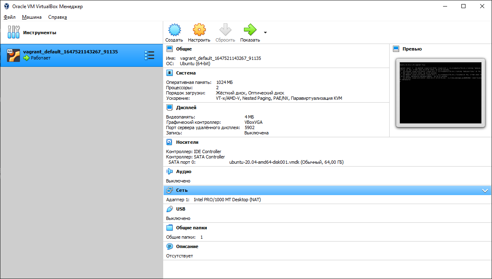

5. Виртуальная машина в VirtualBox:



По умолчанию выделено:

- 1024 МБ оперативной памяти
- 2 процессора
- 4 МБ видеопамяти
- виртуальный жесткий диск 64 ГБ (реально занято 2 ГБ)

6. Как добавить оперативной памяти или ресурсов процессора виртуальной машине?

В файле Vagrantfile добавить параметры конфигурации, запустить машину с обновленным Vagrantfile. Например, я сделал 2048
МБ оперативки и 4 процессора:

```
Vagrant.configure("2") do |config|
    config.vm.box = "bento/ubuntu-20.04"
    config.vm.provider "virtualbox" do |v|
           v.memory = 2048
           v.cpus = 4
    end
end
```

8. Ознакомиться с разделами man bash, почитать о настройках самого bash:

    - какой переменной можно задать длину журнала history, и на какой строчке manual это описывается?
   
   Переменной HISTSIZE, на строке 630

    - что делает директива ignoreboth в bash?
   
   Директива ignoreboth относится к возможным значениям переменной HISTCONTROL, в которой указываются через двоеточие параметры настройки, каким образом команды будут сохраняться в истории команд. Значение ignoreboth указывает, что не будут сохраняться команды, начатые с пробела и также не будут сохраняться дублирующие (повторные) команды.


9. В каких сценариях использования применимы скобки {} и на какой строчке man bash это описано?

