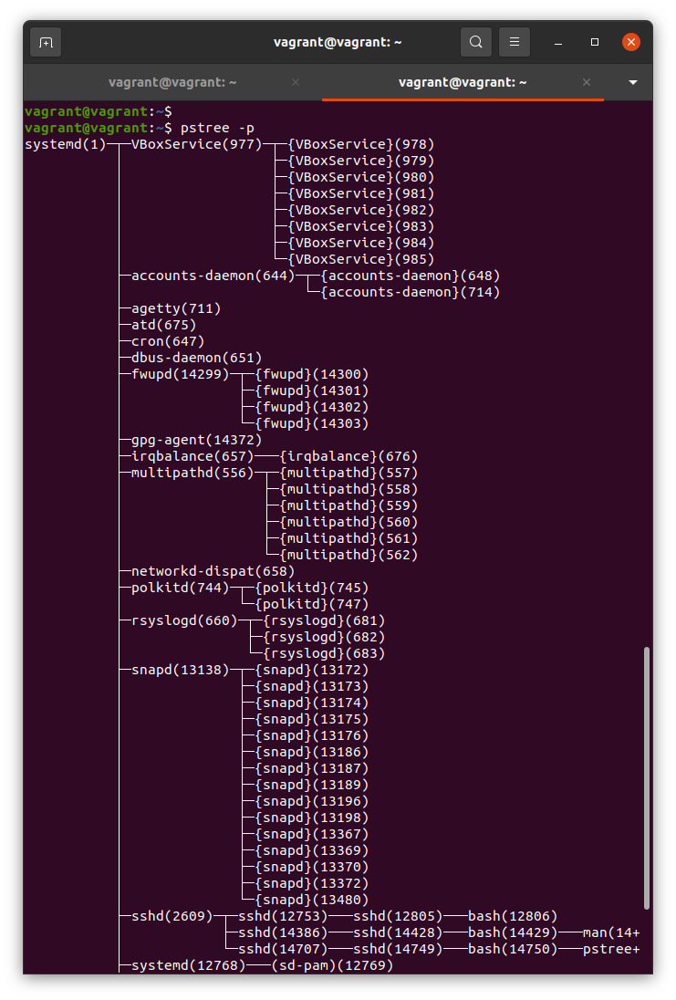
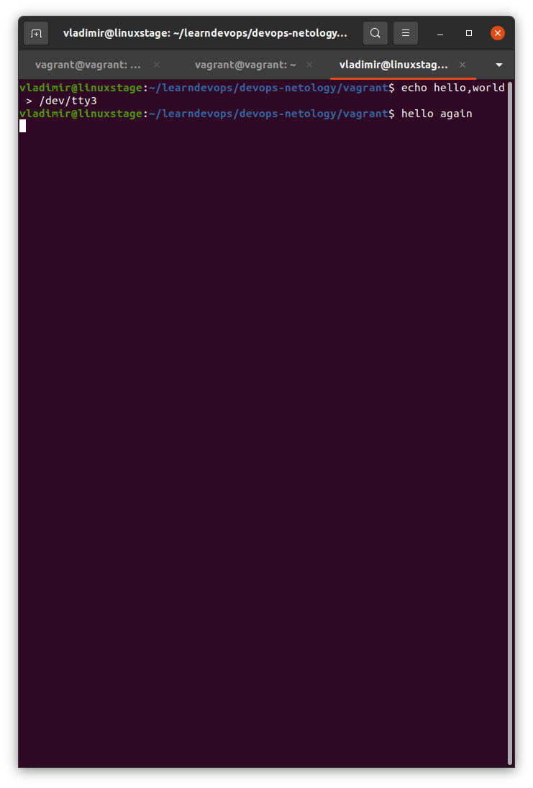

# Домашнее задание к занятию "3.2. Работа в терминале, лекция 2"

1. Какого типа команда `cd`? Попробуйте объяснить, почему она именно такого типа; опишите ход своих мыслей, если
   считаете что она могла бы быть другого типа.

```bash  
vagrant@vagrant:~$ type cd
cd is a shell builtin
```

Команда cd встроенная в bash. Если бы она была внешней, то при запуске создавала бы отдельный процесс, и чтобы после
того, как она отработает, перейти в другой каталог, пришлось бы создавать другой процесс bash, наследуя в него атрибуты
команды.

2. Какая альтернатива без pipe команде `grep <some_string> <some_file> | wc -l`? `man grep` поможет в ответе на этот
   вопрос. Ознакомьтесь с [документом](http://www.smallo.ruhr.de/award.html) о других подобных некорректных вариантах
   использования pipe.

```bash
    grep <some_string> <some_file> -c
```

3. Какой процесс с PID `1` является родителем для всех процессов в вашей виртуальной машине Ubuntu 20.04?

systemd



4. Как будет выглядеть команда, которая перенаправит вывод stderr `ls` на другую сессию терминала?

Мы находимся в консоли pts/1, перенаправляем в консоль pts/2:

`ls 2>/dev/pts/2`

5. Получится ли одновременно передать команде файл на stdin и вывести ее stdout в другой файл? Приведите работающий
   пример.

   Получится. Пример: `sort <testin.txt >testout.txt`

```bash
vagrant@vagrant:~/testc$ cat testin.txt
7
9
1
2

vagrant@vagrant:~/testc$ sort <testin.txt >testout.txt
vagrant@vagrant:~/testc$ cat testout.txt 

1
2
7
9
vagrant@vagrant:~/testc$ 
```

6. Получится ли вывести находясь в графическом режиме данные из PTY в какой-либо из эмуляторов TTY? Сможете ли вы
   наблюдать выводимые данные?

Получилось. В консоли ввел `echo hello,world >/dev/tty3`

В обратную сторону также получилось. Вводил `echo hello again >/dev/pts/2`




7. Выполните команду `bash 5>&1`. К чему она приведет? Что будет, если вы выполните `echo netology > /proc/$$/fd/5`?
   Почему так происходит?

Создастся промежуточный дескриптор и перенаправится в stdout. Если выполнить `echo netology > /proc/$$/fd/5`, то
произойдет вывод netology в этот дескриптор и через него в stdout.

8. Получится ли в качестве входного потока для pipe использовать только stderr команды, не потеряв при этом отображение
   stdout на pty? Напоминаем: по умолчанию через pipe передается только stdout команды слева от `|` на stdin команды
   справа. Это можно сделать, поменяв стандартные потоки местами через промежуточный новый дескриптор, который вы
   научились создавать в предыдущем вопросе.

```bash
    vagrant@vagrant:~$ ls -l 123 5>&2 2>&1 1>&5 | grep 123 
    ls: cannot access '123': No such file or directory
```
5>&2  - новый дескриптор перенаправили в stderr

2>&1 - stderr перенаправили в stdout

1>&5 - stdout перенаправили в новый дескриптор


9. Что выведет команда `cat /proc/$$/environ`? Как еще можно получить аналогичный по содержанию вывод?

Будут выведены переменные окружения и их значения. Аналогичный вывод можно получить командами env и printenv. Если вызывать их без параметров, то переменные будут разделены по строкам. Чтобы вывести все одной строкой, надо вызвать 
`env -0`
или
`printenv -0`

10. Используя `man`, опишите что доступно по адресам `/proc/<PID>/cmdline`, `/proc/<PID>/exe`.

`/proc/<PID>/cmdline` - строка 311, содержит полную команду для запуска данного процесса, за исключением зомби-процесса, для которого она пустая. Также содержит агрументы командной строки для этой команды, в виде набора строк, разделенных \0

`/proc/<PID>/exe` - строка 381, для Linux 2.2 и выше содержит симлинк на актуальный путь для запуска команды. Для Linux 2.0 и ниже содержит указатель на запущенный бинарник, выглядит как симлинк.


11. Узнайте, какую наиболее старшую версию набора инструкций SSE поддерживает ваш процессор с помощью `/proc/cpuinfo`.

sse4_2

`grep sse /proc/cpuinfo`


12. При открытии нового окна терминала и `vagrant ssh` создается новая сессия и выделяется pty. Это можно подтвердить командой `tty`, которая упоминалась в лекции 3.2. Однако:

     ```bash
     vagrant@netology1:~$ ssh localhost 'tty'
     not a tty
     ```

     Почитайте, почему так происходит, и как изменить поведение.

При запуске команды на удаленной машине по ssh, для удаленной сессии по умолчанию не выделяется tty. Если соединяться по ssh без запуска команды, то tty будет выделяться. Чтобы изменить поведение, надо запустить команду с параметром -t:

`ssh -t localhost 'tty'`

13. Бывает, что есть необходимость переместить запущенный процесс из одной сессии в другую. Попробуйте сделать это, воспользовавшись `reptyr`. Например, так можно перенести в `screen` процесс, который вы запустили по ошибке в обычной SSH-сессии.

После установки reptyr ругался на права:

vagrant@vagrant:~$ reptyr 15912
Unable to attach to pid 15912: Operation not permitted
The kernel denied permission while attaching. If your uid matches
the target's, check the value of /proc/sys/kernel/yama/ptrace_scope.
For more information, see /etc/sysctl.d/10-ptrace.conf

После того, как установил kernel.yama.ptrace_scope = 0, удалось перехватить процесс. В pstree он отображается как reptyr


14. `sudo echo string > /root/new_file` не даст выполнить перенаправление под обычным пользователем, так как перенаправлением занимается процесс shell'а, который запущен без `sudo` под вашим пользователем. Для решения данной проблемы можно использовать конструкцию `echo string | sudo tee /root/new_file`. Узнайте что делает команда `tee` и почему в отличие от `sudo echo` команда с `sudo tee` будет работать.

 Команда tee читает из stdin и пишет в stdout и указанные файлы. Здесь мы выполняем ее под sudo, поэтому она запускается под суперпользователем и имеет права на запись в файл.
 