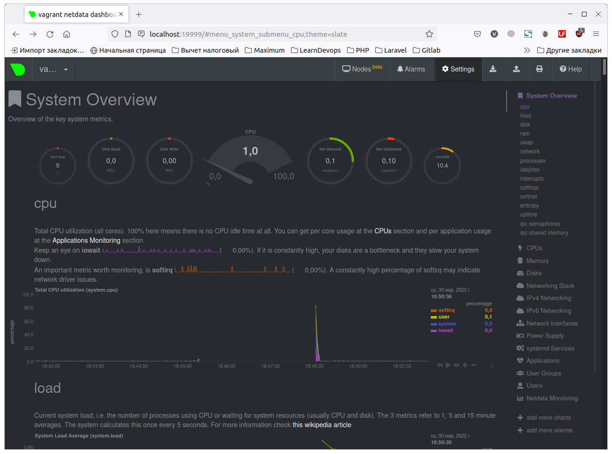

# Домашнее задание к занятию "3.4. Операционные системы, лекция 2"

1. На лекции мы познакомились с [node_exporter](https://github.com/prometheus/node_exporter/releases). В демонстрации его исполняемый файл запускался в background. Этого достаточно для демо, но не для настоящей production-системы, где процессы должны находиться под внешним управлением. Используя знания из лекции по systemd, создайте самостоятельно простой [unit-файл](https://www.freedesktop.org/software/systemd/man/systemd.service.html) для node_exporter:

    * поместите его в автозагрузку,
    * предусмотрите возможность добавления опций к запускаемому процессу через внешний файл (посмотрите, например, на `systemctl cat cron`),
    * удостоверьтесь, что с помощью systemctl процесс корректно стартует, завершается, а после перезагрузки автоматически поднимается.

Установил node_exporter следующими командами:

```bash
curl -LO https://github.com/prometheus/node_exporter/releases/download/v1.3.1/node_exporter-1.3.1.linux-amd64.tar.gz
tar -xvf node_exporter-1.3.1.linux-amd64.tar.gz
sudo mv node_exporter-1.3.1.linux-amd64/node_exporter /usr/local/bin
sudo nano /etc/systemd/system/node_exporter.service
sudo nano /etc/default/node_exporter
sudo systemctl daemon-reload
```

Настроил unit-файл:

```bash
cat /etc/systemd/system/node_exporter.service 
[Unit]
Description=Node Exporter
After=network.target

[Service]
User=vagrant
Group=vagrant
Type=simple
ExecStart=/usr/local/bin/node_exporter
EnvironmentFile=/etc/default/node_exporter

[Install]
WantedBy=multi-user.target
```

Создал файл с добавляемыми переменными окружения:

```bash
cat /etc/default/node_exporter
# This is the sample file for Node Exporter
VP_USER_SAMPLE=vpuser
```

поместил node_exporter в автозагрузку:

`sudo systemctl enable node_exporter`

предусмотрите возможность добавления опций к запускаемому процессу через внешний файл (посмотрите, например, на `systemctl cat cron`),

для этого добавлена секция EnvironmentFile= в /etc/systemd/system/node_exporter.service 


удостоверьтесь, что с помощью systemctl процесс корректно стартует, завершается, а после перезагрузки автоматически поднимается.

Проверил этими командами:

```bash
sudo systemctl start node_exporter
vagrant@vagrant:/tmp$ sudo systemctl status node_exporter
● node_exporter.service - Node Exporter
     Loaded: loaded (/etc/systemd/system/node_exporter.service; enabled; vendor preset: enabled)
     Active: active (running) since Tue 2022-03-29 13:52:40 UTC; 2s ago
   Main PID: 2318 (node_exporter)
      Tasks: 6 (limit: 2278)
     Memory: 2.7M
     CGroup: /system.slice/node_exporter.service
             └─2318 /usr/local/bin/node_exporter

Mar 29 13:52:40 vagrant node_exporter[2318]: ts=2022-03-29T13:52:40.981Z caller=node_exporter.go:115 level=info collector=thermal_zone
Mar 29 13:52:40 vagrant node_exporter[2318]: ts=2022-03-29T13:52:40.981Z caller=node_exporter.go:115 level=info collector=time
Mar 29 13:52:40 vagrant node_exporter[2318]: ts=2022-03-29T13:52:40.981Z caller=node_exporter.go:115 level=info collector=timex
Mar 29 13:52:40 vagrant node_exporter[2318]: ts=2022-03-29T13:52:40.981Z caller=node_exporter.go:115 level=info collector=udp_queues
Mar 29 13:52:40 vagrant node_exporter[2318]: ts=2022-03-29T13:52:40.981Z caller=node_exporter.go:115 level=info collector=uname
Mar 29 13:52:40 vagrant node_exporter[2318]: ts=2022-03-29T13:52:40.981Z caller=node_exporter.go:115 level=info collector=vmstat
Mar 29 13:52:40 vagrant node_exporter[2318]: ts=2022-03-29T13:52:40.981Z caller=node_exporter.go:115 level=info collector=xfs
Mar 29 13:52:40 vagrant node_exporter[2318]: ts=2022-03-29T13:52:40.981Z caller=node_exporter.go:115 level=info collector=zfs
Mar 29 13:52:40 vagrant node_exporter[2318]: ts=2022-03-29T13:52:40.981Z caller=node_exporter.go:199 level=info msg="Listening on" address=:9100
Mar 29 13:52:40 vagrant node_exporter[2318]: ts=2022-03-29T13:52:40.981Z caller=tls_config.go:195 level=info msg="TLS is disabled." http2=false
```

```bash
sudo systemctl stop node_exporter
vagrant@vagrant:/tmp$ sudo systemctl status node_exporter
● node_exporter.service - Node Exporter
     Loaded: loaded (/etc/systemd/system/node_exporter.service; enabled; vendor preset: enabled)
     Active: inactive (dead) since Tue 2022-03-29 13:53:19 UTC; 1s ago
    Process: 2318 ExecStart=/usr/local/bin/node_exporter (code=killed, signal=TERM)
   Main PID: 2318 (code=killed, signal=TERM)

Mar 29 13:52:40 vagrant node_exporter[2318]: ts=2022-03-29T13:52:40.981Z caller=node_exporter.go:115 level=info collector=udp_queues
Mar 29 13:52:40 vagrant node_exporter[2318]: ts=2022-03-29T13:52:40.981Z caller=node_exporter.go:115 level=info collector=uname
Mar 29 13:52:40 vagrant node_exporter[2318]: ts=2022-03-29T13:52:40.981Z caller=node_exporter.go:115 level=info collector=vmstat
Mar 29 13:52:40 vagrant node_exporter[2318]: ts=2022-03-29T13:52:40.981Z caller=node_exporter.go:115 level=info collector=xfs
Mar 29 13:52:40 vagrant node_exporter[2318]: ts=2022-03-29T13:52:40.981Z caller=node_exporter.go:115 level=info collector=zfs
Mar 29 13:52:40 vagrant node_exporter[2318]: ts=2022-03-29T13:52:40.981Z caller=node_exporter.go:199 level=info msg="Listening on" address=:9100
Mar 29 13:52:40 vagrant node_exporter[2318]: ts=2022-03-29T13:52:40.981Z caller=tls_config.go:195 level=info msg="TLS is disabled." http2=false
Mar 29 13:53:19 vagrant systemd[1]: Stopping Node Exporter...
Mar 29 13:53:19 vagrant systemd[1]: node_exporter.service: Succeeded.
Mar 29 13:53:19 vagrant systemd[1]: Stopped Node Exporter.
```

После рестарта вируталки:

```bash
sudo systemctl status node_exporter
● node_exporter.service - Node Exporter
     Loaded: loaded (/etc/systemd/system/node_exporter.service; enabled; vendor preset: enabled)
     Active: active (running) since Tue 2022-03-29 13:54:46 UTC; 10s ago
   Main PID: 667 (node_exporter)
      Tasks: 5 (limit: 2278)
     Memory: 14.1M
     CGroup: /system.slice/node_exporter.service
             └─667 /usr/local/bin/node_exporter

Mar 29 13:54:46 vagrant node_exporter[667]: ts=2022-03-29T13:54:46.187Z caller=node_exporter.go:115 level=info collector=thermal_zone
Mar 29 13:54:46 vagrant node_exporter[667]: ts=2022-03-29T13:54:46.187Z caller=node_exporter.go:115 level=info collector=time
Mar 29 13:54:46 vagrant node_exporter[667]: ts=2022-03-29T13:54:46.187Z caller=node_exporter.go:115 level=info collector=timex
Mar 29 13:54:46 vagrant node_exporter[667]: ts=2022-03-29T13:54:46.187Z caller=node_exporter.go:115 level=info collector=udp_queues
Mar 29 13:54:46 vagrant node_exporter[667]: ts=2022-03-29T13:54:46.187Z caller=node_exporter.go:115 level=info collector=uname
Mar 29 13:54:46 vagrant node_exporter[667]: ts=2022-03-29T13:54:46.187Z caller=node_exporter.go:115 level=info collector=vmstat
Mar 29 13:54:46 vagrant node_exporter[667]: ts=2022-03-29T13:54:46.187Z caller=node_exporter.go:115 level=info collector=xfs
Mar 29 13:54:46 vagrant node_exporter[667]: ts=2022-03-29T13:54:46.187Z caller=node_exporter.go:115 level=info collector=zfs
Mar 29 13:54:46 vagrant node_exporter[667]: ts=2022-03-29T13:54:46.187Z caller=node_exporter.go:199 level=info msg="Listening on" address=:9100
Mar 29 13:54:46 vagrant node_exporter[667]: ts=2022-03-29T13:54:46.187Z caller=tls_config.go:195 level=info msg="TLS is disabled." http2=false
```


2. Ознакомьтесь с опциями node_exporter и выводом `/metrics` по-умолчанию. Приведите несколько опций, которые вы бы выбрали для базового мониторинга хоста по CPU, памяти, диску и сети.

Для CPU:
```
# HELP node_cpu_seconds_total Seconds the CPUs spent in each mode.
# TYPE node_cpu_seconds_total counter
# HELP node_procs_running Number of processes in runnable state.
# TYPE node_procs_running gauge
# HELP node_schedstat_running_seconds_total Number of seconds CPU spent running a process.
# TYPE node_schedstat_running_seconds_total counter
# HELP node_schedstat_running_seconds_total Number of seconds CPU spent running a process.
# TYPE node_schedstat_running_seconds_total counter
# HELP node_schedstat_timeslices_total Number of timeslices executed by CPU.
# TYPE node_schedstat_timeslices_total counter
# HELP node_schedstat_waiting_seconds_total Number of seconds spent by processing waiting for this CPU.
# TYPE node_schedstat_waiting_seconds_total counter
```

Для памяти:
```
# HELP node_memory_MemAvailable_bytes Memory information field MemAvailable_bytes.
# TYPE node_memory_MemAvailable_bytes gauge
# HELP node_memory_MemFree_bytes Memory information field MemFree_bytes.
# TYPE node_memory_MemFree_bytes gauge
```

Для диска:
```
# HELP node_filesystem_free_bytes Filesystem free space in bytes.
# TYPE node_filesystem_free_bytes gauge
# HELP node_filesystem_size_bytes Filesystem size in bytes.
# TYPE node_filesystem_size_bytes gauge
# HELP node_disk_io_time_seconds_total Total seconds spent doing I/Os.
# TYPE node_disk_io_time_seconds_total counter
# HELP node_disk_read_bytes_total The total number of bytes read successfully.
# TYPE node_disk_read_bytes_total counter
# HELP node_disk_read_time_seconds_total The total number of seconds spent by all reads.
# TYPE node_disk_read_time_seconds_total counter
# HELP node_disk_written_bytes_total The total number of bytes written successfully.
# TYPE node_disk_written_bytes_total counter
# HELP node_disk_write_time_seconds_total This is the total number of seconds spent by all writes.
# TYPE node_disk_write_time_seconds_total counter
```

Для сети:
```
# HELP node_network_up Value is 1 if operstate is 'up', 0 otherwise.
# TYPE node_network_up gauge
# HELP node_network_transmit_bytes_total Network device statistic transmit_bytes.
# TYPE node_network_transmit_bytes_total counter
# HELP node_network_receive_bytes_total Network device statistic receive_bytes.
# TYPE node_network_receive_bytes_total counter
```

3. Установите в свою виртуальную машину [Netdata](https://github.com/netdata/netdata). Воспользуйтесь [готовыми пакетами](https://packagecloud.io/netdata/netdata/install) для установки (`sudo apt install -y netdata`). После успешной установки:
    * в конфигурационном файле `/etc/netdata/netdata.conf` в секции [web] замените значение с localhost на `bind to = 0.0.0.0`,
    * добавьте в Vagrantfile проброс порта Netdata на свой локальный компьютер и сделайте `vagrant reload`:

    ```bash
    config.vm.network "forwarded_port", guest: 19999, host: 19999
    ```

    После успешной перезагрузки в браузере *на своем ПК* (не в виртуальной машине) вы должны суметь зайти на `localhost:19999`. Ознакомьтесь с метриками, которые по умолчанию собираются Netdata и с комментариями, которые даны к этим метрикам.

Установил:



4. Можно ли по выводу `dmesg` понять, осознает ли ОС, что загружена не на настоящем оборудовании, а на системе виртуализации?

Да, в выводе dmesg -T присутствуют строки, указываююище на это. На вритуальной машине это:

```bash
[Wed Mar 30 15:47:51 2022] Booting paravirtualized kernel on KVM
```

На физической машине:

```bash
[Ср мар 30 18:46:09 2022] Booting paravirtualized kernel on bare hardware
```
 

5. Как настроен sysctl `fs.nr_open` на системе по-умолчанию? Узнайте, что означает этот параметр. Какой другой существующий лимит не позволит достичь такого числа (`ulimit --help`)?

```bash
vagrant@vagrant:~$ sysctl fs.nr_open
fs.nr_open = 1048576
```

 fs.nr_open - это жесткий лимит на количество открытых дескрипторов

```bash
vagrant@vagrant:~$ ulimit -Sn
1024
vagrant@vagrant:~$ ulimit -Hn
1048576
```

ulimit -Sn - мягкий лимит на количество открытых файлов 
ulimit -Hn - жесткий лимит на количество открытых файлов, служит верхней границей для мягкого лимита 


6. Запустите любой долгоживущий процесс (не `ls`, который отработает мгновенно, а, например, `sleep 1h`) в отдельном неймспейсе процессов; покажите, что ваш процесс работает под PID 1 через `nsenter`. Для простоты работайте в данном задании под root (`sudo -i`). Под обычным пользователем требуются дополнительные опции (`--map-root-user`) и т.д.

В первом терминале создал отдельный неймспейс. Вводил команды:
```bash
screen
sudo unshare -f --pid --mount-proc /bin/bash
```
далее посмотрел текущие процессы и запустил sleep 1h:
```bash
root@vagrant:/home/vagrant# ps uf
USER         PID %CPU %MEM    VSZ   RSS TTY      STAT START   TIME COMMAND
root           1  0.0  0.1   7236  4040 pts/1    S    11:31   0:00 /bin/bash
root           8  0.0  0.1   8892  3464 pts/1    R+   11:34   0:00 ps uf
root@vagrant:/home/vagrant# sleep 1h
```

Во втором терминале посмотрел на текущие процессы, затем выполнил вход в неймспес через nsenter и убедился, что процесс работает из-под PID 1:

```bash
vagrant@vagrant:~$ sudo -i
root@vagrant:~# ps f
    PID TTY      STAT   TIME COMMAND
   2550 pts/2    S      0:00 sudo -i
   2551 pts/2    S      0:00  \_ -bash
   2562 pts/2    R+     0:00      \_ ps f
   2227 pts/1    S      0:00 sudo unshare -f --pid --mount-proc /bin/bash
   2229 pts/1    S      0:00  \_ unshare -f --pid --mount-proc /bin/bash
   2230 pts/1    S      0:00      \_ /bin/bash
   2341 pts/1    S+     0:00          \_ sleep 1h
    708 tty1     Ss+    0:00 /sbin/agetty -o -p -- \u --noclear tty1 linux
root@vagrant:~# nsenter --target 2230 --pid --mount
root@vagrant:/# ps uf
USER         PID %CPU %MEM    VSZ   RSS TTY      STAT START   TIME COMMAND
root          23  0.2  0.2   7236  4164 pts/2    S    11:39   0:00 -bash
root          34  0.0  0.1   8892  3452 pts/2    R+   11:39   0:00  \_ ps uf
root           1  0.0  0.2   7236  4096 pts/1    S    11:31   0:00 /bin/bash
root           9  0.0  0.0   5476   592 pts/1    S+   11:35   0:00 sleep 1h
```


7. Найдите информацию о том, что такое `:(){ :|:& };:`. Запустите эту команду в своей виртуальной машине Vagrant с Ubuntu 20.04 (**это важно, поведение в других ОС не проверялось**). Некоторое время все будет "плохо", после чего (минуты) – ОС должна стабилизироваться. Вызов `dmesg` расскажет, какой механизм помог автоматической стабилизации. Как настроен этот механизм по-умолчанию, и как изменить число процессов, которое можно создать в сессии?


В этой строчке, похожей на смайлик в виде сердитого человека, мы объявляем функцию с именем в виде двоеточия. Затем через точку с запятой эта функция вызывается. Собственно `:(){}` - это объявление функции, а `:(){};:` это вызов данной функции после ее объявления. В теле функции между фигурных скобок мы повторно вызываем ее (с помощью двоеточий). Символ | скорее всего является обозначением конвейера - мы передаем stdout первого вызова функции на stdin второго вызова. Символ & после двойного вызова функции означает выполнение команды в фоне. То есть тело функции :|:&  - это конвейер из двух вызовов функции :, выполняемый в фоне. Таким образом, мы запускаем цепную реакцию порождения процессов в виде рекурсии с прогрессией.

Вывод команды начинает сыпать подобными сообщениями:

```bash
-bash: fork: retry: Resource temporarily unavailable
-bash: fork: retry: Resource temporarily unavailable
-bash: fork: retry: Resource temporarily unavailable
-bash: fork: retry: Resource temporarily unavailable
-bash: fork: retry: Resource temporarily unavailable
-bash: fork: Resource temporarily unavailable
-bash: fork: Resource temporarily unavailable
```

затем вывод останавливается, и при нажатии Enter на клавиатуре возвращается в командную строку.

Вывод dmesg -T содержит такие строки:

```bash
[Thu Mar 31 12:03:23 2022] 12:03:23.499051 main     Executable: /opt/VBoxGuestAdditions-6.1.30/sbin/VBoxService
                           12:03:23.499052 main     Process ID: 1485
                           12:03:23.499052 main     Package type: LINUX_64BITS_GENERIC
[Thu Mar 31 12:03:23 2022] 12:03:23.500058 main     6.1.30 r148432 started. Verbose level = 0
[Thu Mar 31 12:03:23 2022] 12:03:23.501513 main     vbglR3GuestCtrlDetectPeekGetCancelSupport: Supported (#1)
[Thu Mar 31 12:04:45 2022] cgroup: fork rejected by pids controller in /user.slice/user-1000.slice/session-3.scope
[Thu Mar 31 12:04:56 2022] cgroup: fork rejected by pids controller in /user.slice/user-1000.slice/session-5.scope
[Thu Mar 31 12:05:03 2022] cgroup: fork rejected by pids controller in /user.slice/user-1000.slice/session-6.scope
```

"Размножение" процесса остановлено системой с помощью механизма сontrol groups (cgroups). Мы превысили допустимое потребление в слайсе User. 
Число процессов можно регулировать `ulimit -u <число процессов>`, либо регулировать потребление для слайса командой `systemctl set-property user.slice имя_параметра=значение`
 