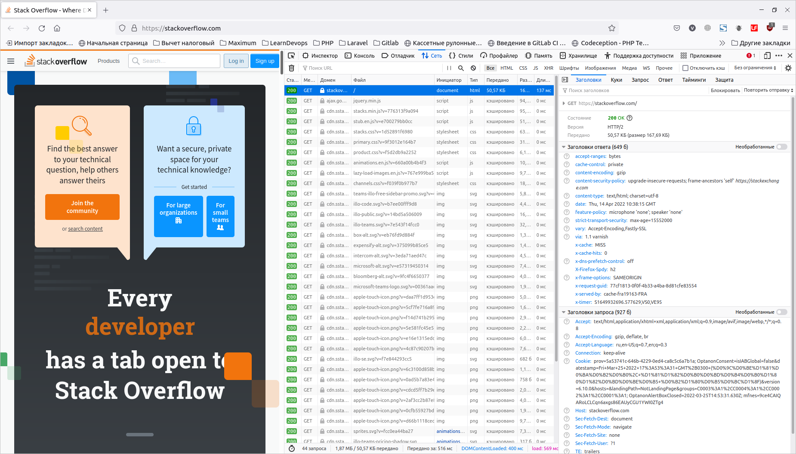
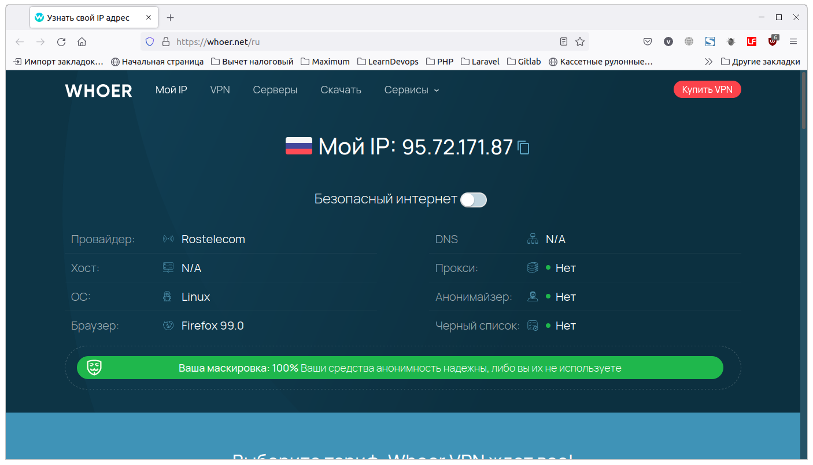
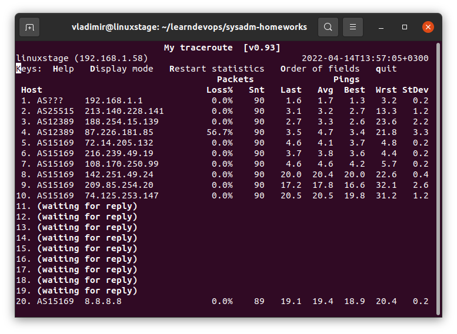

# Домашнее задание к занятию "3.6. Компьютерные сети, лекция 1"

1. Работа c HTTP через телнет.
- Подключитесь утилитой телнет к сайту stackoverflow.com
`telnet stackoverflow.com 80`
- отправьте HTTP запрос
```bash
GET /questions HTTP/1.0
HOST: stackoverflow.com
[press enter]
[press enter]
```
- В ответе укажите полученный HTTP код, что он означает?

Получил код 301, что означает, что страница постоянно перемещена. В данном случае, происходит редирект на https-версию страницы:

```bash
vladimir@linuxstage:~/learndevops/sysadm-homeworks$ telnet stackoverflow.com 80
Trying 151.101.1.69...
Connected to stackoverflow.com.
Escape character is '^]'.
GET /questions HTTP/1.0
HOST: stackoverflow.com

HTTP/1.1 301 Moved Permanently
cache-control: no-cache, no-store, must-revalidate
location: https://stackoverflow.com/questions
x-request-guid: 82331ee1-fc32-4bf5-8aa1-896a59f7cf5d
feature-policy: microphone 'none'; speaker 'none'
content-security-policy: upgrade-insecure-requests; frame-ancestors 'self' https://stackexchange.com
Accept-Ranges: bytes
Date: Thu, 14 Apr 2022 10:21:35 GMT
Via: 1.1 varnish
Connection: close
X-Served-By: cache-fra19177-FRA
X-Cache: MISS
X-Cache-Hits: 0
X-Timer: S1649931695.061508,VS0,VE92
Vary: Fastly-SSL
X-DNS-Prefetch-Control: off
Set-Cookie: prov=0e554ec1-d8ec-05fd-a467-d09ebb6aae0c; domain=.stackoverflow.com; expires=Fri, 01-Jan-2055 00:00:00 GMT; path=/; HttpOnly

Connection closed by foreign host.
```


2. Повторите задание 1 в браузере, используя консоль разработчика F12.
- откройте вкладку `Network`
- отправьте запрос http://stackoverflow.com
- найдите первый ответ HTTP сервера, откройте вкладку `Headers`
- укажите в ответе полученный HTTP код.
- проверьте время загрузки страницы, какой запрос обрабатывался дольше всего?
- приложите скриншот консоли браузера в ответ.

Пришел код 200. Дольше всего обрабатывался запрос самой страницы (137 мс), все остальные файлы подтягивались из кэша за нулевое время:



3. Какой IP адрес у вас в интернете?

 95.72.171.87:




4. Какому провайдеру принадлежит ваш IP адрес? Какой автономной системе AS? Воспользуйтесь утилитой `whois`

Провайдер Ростелеком, автономная система AS12389:

```bash
vladimir@linuxstage:~/learndevops/sysadm-homeworks$ whois -h whois.radb.net 95.72.171.87
route:          95.72.168.0/21
descr:          Rostelecom networks
origin:         AS12389
notify:         ripe@rt.ru
mnt-by:         ROSTELECOM-MNT
created:        2018-10-31T12:34:35Z
last-modified:  2018-10-31T12:34:35Z
source:         RIPE
remarks:        ****************************
remarks:        * THIS OBJECT IS MODIFIED
remarks:        * Please note that all data that is generally regarded as personal
remarks:        * data has been removed from this object.
remarks:        * To view the original object, please query the RIPE Database at:
remarks:        * http://www.ripe.net/whois
remarks:        ****************************
```

5. Через какие сети проходит пакет, отправленный с вашего компьютера на адрес 8.8.8.8? Через какие AS? Воспользуйтесь утилитой `traceroute`

Через AS AS2551, AS12389, AS15169, сети 192, 213, 188, 87, 74, 108, 142, 72, 172, 216, 8:

```bash
vladimir@linuxstage:~/learndevops/sysadm-homeworks$ traceroute -An 8.8.8.8
traceroute to 8.8.8.8 (8.8.8.8), 30 hops max, 60 byte packets
 1  192.168.1.1 [*]  4.519 ms  4.500 ms  4.496 ms
 2  213.140.228.141 [AS25515]  5.161 ms  5.157 ms  5.153 ms
 3  188.254.15.135 [AS12389]  5.503 ms 188.254.15.139 [AS12389]  5.502 ms  5.498 ms
 4  87.226.183.89 [AS12389]  6.520 ms  6.516 ms 87.226.181.89 [AS12389]  6.512 ms
 5  74.125.51.172 [AS15169]  9.555 ms 5.143.253.105 [AS12389]  9.610 ms 5.143.253.245 [AS12389]  9.512 ms
 6  108.170.250.34 [AS15169]  7.399 ms * *
 7  142.251.49.158 [AS15169]  20.130 ms 72.14.234.20 [AS15169]  17.559 ms 72.14.235.226 [AS15169]  4.510 ms
 8  142.251.238.72 [AS15169]  19.970 ms 108.170.250.51 [AS15169]  4.487 ms 72.14.238.168 [AS15169]  20.627 ms
 9  172.253.79.115 [AS15169]  19.096 ms 172.253.51.249 [AS15169]  20.608 ms 216.239.57.229 [AS15169]  22.120 ms
10  72.14.232.190 [AS15169]  18.126 ms * 142.251.238.66 [AS15169]  19.879 ms
11  172.253.51.239 [AS15169]  19.864 ms 216.239.48.97 [AS15169]  23.303 ms 172.253.51.249 [AS15169]  19.847 ms
12  * * *
13  * * *
14  * * *
15  * * *
16  * 8.8.8.8 [AS15169]  22.012 ms *
```


6. Повторите задание 5 в утилите `mtr`. На каком участке наибольшая задержка - delay?

Наибольшая задержка на участках 8 и 10, там наибольшие значения в колонке Avg - среднее время задержки:



7. Какие DNS сервера отвечают за доменное имя dns.google? Какие A записи? воспользуйтесь утилитой `dig`


DNS-сервера:
 - ns1.zdns.google.
 - ns4.zdns.google.
 - ns3.zdns.google.
 - ns2.zdns.google.

```bash
vladimir@linuxstage:~/learndevops/sysadm-homeworks$ dig dns.google NS +short
ns1.zdns.google.
ns4.zdns.google.
ns3.zdns.google.
ns2.zdns.google.
```


А-записи: 8.8.8.8, 8.8.4.4

В краткой форме команды, без указания типа записи выведутся по умолчанию А-записи:
```bash
vladimir@linuxstage:~/learndevops/sysadm-homeworks$ dig dns.google +short
8.8.8.8
8.8.4.4
```

В более расширенной форме:
```bash
vladimir@linuxstage:~/learndevops/sysadm-homeworks$ dig dns.google +noall +answer
dns.google.		831	IN	A	8.8.8.8
dns.google.		831	IN	A	8.8.4.4
```

Также можно указать тип записи А явно:
```bash
vladimir@linuxstage:~/learndevops/sysadm-homeworks$ dig dns.google A +short
8.8.4.4
8.8.8.8
```

8. Проверьте PTR записи для IP адресов из задания 7. Какое доменное имя привязано к IP? воспользуйтесь утилитой `dig`

PTR-запись - dns.google.:

Подробная форма команды:
```bash
vladimir@linuxstage:~/learndevops/sysadm-homeworks$ dig -x 8.8.4.4 PTR 

; <<>> DiG 9.16.1-Ubuntu <<>> -x 8.8.4.4 PTR
;; global options: +cmd
;; Got answer:
;; ->>HEADER<<- opcode: QUERY, status: NOERROR, id: 11407
;; flags: qr rd ra; QUERY: 1, ANSWER: 1, AUTHORITY: 0, ADDITIONAL: 1

;; OPT PSEUDOSECTION:
; EDNS: version: 0, flags:; udp: 65494
;; QUESTION SECTION:
;4.4.8.8.in-addr.arpa.		IN	PTR

;; ANSWER SECTION:
4.4.8.8.in-addr.arpa.	86400	IN	PTR	dns.google.

;; Query time: 179 msec
;; SERVER: 127.0.0.53#53(127.0.0.53)
;; WHEN: Чт апр 14 14:55:09 MSK 2022
;; MSG SIZE  rcvd: 73
```

Краткие формы команды:
```bash
vladimir@linuxstage:~/learndevops/sysadm-homeworks$ dig -x 8.8.8.8 PTR +short
dns.google.
vladimir@linuxstage:~/learndevops/sysadm-homeworks$ dig -x 8.8.4.4 PTR +short
dns.google.
vladimir@linuxstage:~/learndevops/sysadm-homeworks$ dig -x 8.8.8.8 PTR +noall +answer
8.8.8.8.in-addr.arpa.	7166	IN	PTR	dns.google.
vladimir@linuxstage:~/learndevops/sysadm-homeworks$ dig -x 8.8.4.4 PTR +noall +answer
4.4.8.8.in-addr.arpa.	7145	IN	PTR	dns.google.
vladimir@linuxstage:~/learndevops/sysadm-homeworks$ 
```

Домен- dns.google.:
```bash
vladimir@linuxstage:~/learndevops/sysadm-homeworks$ dig -x 8.8.8.8 +short
dns.google.
vladimir@linuxstage:~/learndevops/sysadm-homeworks$ dig -x 8.8.4.4 +short
dns.google.
```


