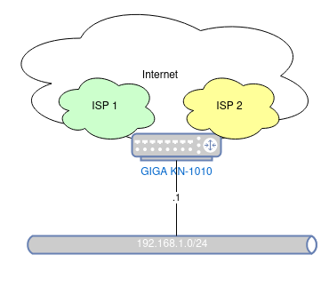
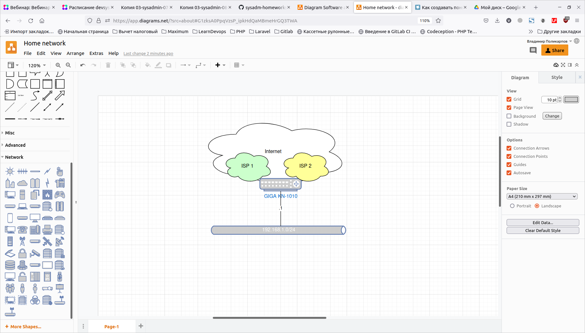

# Домашнее задание к занятию "3.8. Компьютерные сети, лекция 3"

1. Подключитесь к публичному маршрутизатору в интернет. Найдите маршрут к вашему публичному IP
```
telnet route-views.routeviews.org
Username: rviews
show ip route x.x.x.x/32
show bgp x.x.x.x/32
```

Подключился, но с указанием маски /32 команды не работали. show ip route ругалась на недопустимый символ /, а show bgp сообщила, что такой сети нет в таблице. Без указания маски команды отработали:


```
vladimir@linuxstage:~$ telnet route-views.routeviews.org
Trying 128.223.51.103...
Connected to route-views.routeviews.org.
Escape character is '^]'.
C
**********************************************************************

                    RouteViews BGP Route Viewer
                    route-views.routeviews.org

 route views data is archived on http://archive.routeviews.org

 This hardware is part of a grant by the NSF.
 Please contact help@routeviews.org if you have questions, or
 if you wish to contribute your view.

 This router has views of full routing tables from several ASes.
 The list of peers is located at http://www.routeviews.org/peers
 in route-views.oregon-ix.net.txt

 NOTE: The hardware was upgraded in August 2014.  If you are seeing
 the error message, "no default Kerberos realm", you may want to
 in Mac OS X add "default unset autologin" to your ~/.telnetrc

 To login, use the username "rviews".

 **********************************************************************

User Access Verification

Username: rviews
route-views>show ip route 95.72.33.172/32
                                      ^
% Invalid input detected at '^' marker.

route-views>show ip route 95.72.33.172   
Routing entry for 95.72.32.0/21
  Known via "bgp 6447", distance 20, metric 0
  Tag 2497, type external
  Last update from 202.232.0.2 7w0d ago
  Routing Descriptor Blocks:
  * 202.232.0.2, from 202.232.0.2, 7w0d ago
      Route metric is 0, traffic share count is 1
      AS Hops 2
      Route tag 2497
      MPLS label: none
route-views>show bgp 95.72.33.172/32     
% Network not in table
route-views>show bgp 95.72.33.172   
BGP routing table entry for 95.72.32.0/21, version 307623843
Paths: (24 available, best #20, table default)
  Not advertised to any peer
  Refresh Epoch 1
  3333 1103 12389
    193.0.0.56 from 193.0.0.56 (193.0.0.56)
      Origin IGP, localpref 100, valid, external
      path 7FE034D81CA8 RPKI State not found
      rx pathid: 0, tx pathid: 0
  Refresh Epoch 1
  8283 1299 12389
    94.142.247.3 from 94.142.247.3 (94.142.247.3)
      Origin IGP, metric 0, localpref 100, valid, external
      Community: 1299:30000 8283:1 8283:101
      unknown transitive attribute: flag 0xE0 type 0x20 length 0x18
        value 0000 205B 0000 0000 0000 0001 0000 205B
              0000 0005 0000 0001 
      path 7FE17EDE9E68 RPKI State not found
      rx pathid: 0, tx pathid: 0
  Refresh Epoch 1
  53767 174 12389
    162.251.163.2 from 162.251.163.2 (162.251.162.3)
      Origin IGP, localpref 100, valid, external
      Community: 174:21101 174:22005 53767:5000
      path 7FE0E1146218 RPKI State not found
      rx pathid: 0, tx pathid: 0
  Refresh Epoch 1
  3267 1299 12389
    194.85.40.15 from 194.85.40.15 (185.141.126.1)
      Origin IGP, metric 0, localpref 100, valid, external
      path 7FE0E4A5B898 RPKI State not found
      rx pathid: 0, tx pathid: 0
  Refresh Epoch 1
  3561 3910 3356 12389
    206.24.210.80 from 206.24.210.80 (206.24.210.80)
      Origin IGP, localpref 100, valid, external
      path 7FE098C56EE8 RPKI State not found
      rx pathid: 0, tx pathid: 0
  Refresh Epoch 1
  7018 3356 12389
    12.0.1.63 from 12.0.1.63 (12.0.1.63)
      Origin IGP, localpref 100, valid, external
      Community: 7018:5000 7018:37232
      path 7FE0E313F048 RPKI State not found
      rx pathid: 0, tx pathid: 0
  Refresh Epoch 1
  3356 12389
    4.68.4.46 from 4.68.4.46 (4.69.184.201)
      Origin IGP, metric 0, localpref 100, valid, external
```


2. Создайте dummy0 интерфейс в Ubuntu. Добавьте несколько статических маршрутов. Проверьте таблицу маршрутизации.

Создаем dummy0-интерфейс с адресом 10.1.1.1/32:

```
root@linuxstage:/home/vladimir# echo "dummy" >> /etc/modules
root@linuxstage:/home/vladimir# echo "options dummy numdummies=2" > /etc/modprobe.d/dummy.conf
root@linuxstage:/home/vladimir# nano /etc/network/interfaces
root@linuxstage:/home/vladimir# cat /etc/network/interfaces
# interfaces(5) file used by ifup(8) and ifdown(8)
# Include files from /etc/network/interfaces.d:
source-directory /etc/network/interfaces.d

auto dummy0
iface dummy0 inet static
    address 10.1.1.1/32
    pre-up ip link add dummy0 type dummy
    post-down ip link del dummy0
```

После рестарта проверяем наличие dummy0-интерфейса:

```
vladimir@linuxstage:~$ ip -c -br link
lo               UNKNOWN        00:00:00:00:00:00 <LOOPBACK,UP,LOWER_UP> 
wlp0s20f3        UP             28:11:a8:de:75:01 <BROADCAST,MULTICAST,UP,LOWER_UP> 
dummy0           UNKNOWN        ca:88:48:4e:cf:2b <BROADCAST,NOARP,UP,LOWER_UP> 
```

Проверим текущую таблицу маршрутизации:

```
vladimir@linuxstage:~$ ip -br route
default via 192.168.1.1 dev wlp0s20f3 proto dhcp metric 600 
169.254.0.0/16 dev dummy0 scope link metric 1000 
192.168.1.0/24 dev wlp0s20f3 proto kernel scope link src 192.168.1.58 metric 600 
```

Добавим статические маршруты и снова проверим таблицу маршрутизации. Новые маршруты добавились в таблицу маршрутизации:

```
vladimir@linuxstage:~$ sudo ip route add 172.16.10.0/24 dev dummy0
vladimir@linuxstage:~$ sudo ip route add 172.16.8.0/29 dev dummy0
vladimir@linuxstage:~$ ip -br route
default via 192.168.1.1 dev wlp0s20f3 proto dhcp metric 600 
169.254.0.0/16 dev dummy0 scope link metric 1000 
172.16.8.0/29 dev dummy0 scope link 
172.16.10.0/24 dev dummy0 scope link 
192.168.1.0/24 dev wlp0s20f3 proto kernel scope link src 192.168.1.58 metric 600 
```

3. Проверьте открытые TCP порты в Ubuntu, какие протоколы и приложения используют эти порты? Приведите несколько примеров.

Проверяем открытые порты TCP:

```
vladimir@linuxstage:~$ ss -ltnp
vladimir@linuxstage:~$ ss -ltnpa
State       Recv-Q    Send-Q            Local Address:Port              Peer Address:Port    Process                                   
LISTEN      0         4096              127.0.0.53%lo:53                     0.0.0.0:*                                                 
LISTEN      0         5                     127.0.0.1:631                    0.0.0.0:*                                                 
ESTAB       0         0                     127.0.0.1:39532                127.0.0.1:63342    users:(("jcef_helper",pid=3523,fd=28))   
ESTAB       0         0                  192.168.1.58:47072          213.180.204.179:443      users:(("yandex-disk",pid=2353,fd=17))   
TIME-WAIT   0         0                  192.168.1.58:47790          213.180.204.148:443                                               
ESTAB       0         0                  192.168.1.58:48042             34.209.200.8:443      users:(("firefox",pid=2471,fd=186))      
ESTAB       0         0                     127.0.0.1:39530                127.0.0.1:63342    users:(("jcef_helper",pid=3523,fd=27))   
ESTAB       0         0                     127.0.0.1:39526                127.0.0.1:63342    users:(("jcef_helper",pid=3523,fd=24))   
TIME-WAIT   0         0                  192.168.1.58:40990            142.251.1.106:443                                               
ESTAB       0         0                     127.0.0.1:39536                127.0.0.1:63342    users:(("jcef_helper",pid=3523,fd=30))   
ESTAB       0         0                     127.0.0.1:39534                127.0.0.1:63342    users:(("jcef_helper",pid=3523,fd=29))   
ESTAB       0         0                     127.0.0.1:39524                127.0.0.1:63342    users:(("jcef_helper",pid=3523,fd=23))   
ESTAB       0         0                  192.168.1.58:43402            140.82.112.26:443      users:(("firefox",pid=2471,fd=134))      
TIME-WAIT   0         0                  192.168.1.58:58516           108.177.14.139:443                                               
LISTEN      0         4096         [::ffff:127.0.0.1]:6942                         *:*        users:(("java",pid=3388,fd=29))          
LISTEN      0         4096         [::ffff:127.0.0.1]:63342                        *:*        users:(("java",pid=3388,fd=54))          
LISTEN      0         5                         [::1]:631                       [::]:*                                                 
ESTAB       0         0            [::ffff:127.0.0.1]:63342       [::ffff:127.0.0.1]:39524    users:(("java",pid=3388,fd=125))         
ESTAB       0         0            [::ffff:127.0.0.1]:63342       [::ffff:127.0.0.1]:39530    users:(("java",pid=3388,fd=134))         
ESTAB       0         0            [::ffff:127.0.0.1]:63342       [::ffff:127.0.0.1]:39526    users:(("java",pid=3388,fd=128))         
ESTAB       0         0            [::ffff:127.0.0.1]:63342       [::ffff:127.0.0.1]:39536    users:(("java",pid=3388,fd=138))         
ESTAB       0         0            [::ffff:127.0.0.1]:63342       [::ffff:127.0.0.1]:39534    users:(("java",pid=3388,fd=137))         
ESTAB       0         0            [::ffff:127.0.0.1]:63342       [::ffff:127.0.0.1]:39532    users:(("java",pid=3388,fd=136))                       
```

Видим, что используются ряд портов, например порты 53, 631, 6942, 63342, 631

Порты 6942,63342 используются процессом с pid=3388. Если посмотреть данные по этому процессу, то будет видно, что это процесс java, запущенный из PyCharm:

```
vladimir@linuxstage:~$ ps -aux | grep 3388
vladimir    3388 17.9 25.0 8952364 1991696 ?     Sl   14:24   4:42 /snap/pycharm-professional/280/jbr/bin/java -classpath /snap/pycharm-professional/280/lib/util.jar:/snap/pycharm-professional/280/lib/app.jar ...
```

Для порта 53 выполнил комнаду lsof:

```
vladimir@linuxstage:~$ sudo lsof -i :53
COMMAND   PID            USER   FD   TYPE DEVICE SIZE/OFF NODE NAME
systemd-r 761 systemd-resolve   12u  IPv4  34172      0t0  UDP localhost:domain 
systemd-r 761 systemd-resolve   13u  IPv4  34173      0t0  TCP localhost:domain (LISTEN)
```

Видим, что этот порт заняты службой systemd-resolved — служба systemd, выполняющая разрешение сетевых имён для локальных приложений. Предположительно, по TCP и UPD-протоколам.

Для порта 631:

```
vladimir@linuxstage:~$ sudo lsof -i :631
COMMAND    PID USER   FD   TYPE DEVICE SIZE/OFF NODE NAME
cupsd      863 root    6u  IPv6  34531      0t0  TCP ip6-localhost:ipp (LISTEN)
cupsd      863 root    7u  IPv4  34532      0t0  TCP localhost:ipp (LISTEN)
cups-brow 1012 root    7u  IPv4  30382      0t0  UDP *:631 
```

Видим, что порт занят службами CUPS - это Общая система печати UNIX. Предположительно, по TCP и UPD-протоколам.

4. Проверьте используемые UDP сокеты в Ubuntu, какие протоколы и приложения используют эти порты?

```
vladimir@linuxstage:~$ ss -lunpa
State         Recv-Q        Send-Q                         Local Address:Port                  Peer Address:Port        Process        
UNCONN        0             0                                    0.0.0.0:5353                       0.0.0.0:*                          
UNCONN        0             0                              127.0.0.53%lo:53                         0.0.0.0:*                          
ESTAB         0             0                     192.168.1.58%wlp0s20f3:68                     192.168.1.1:67                         
UNCONN        0             0                                    0.0.0.0:631                        0.0.0.0:*                          
UNCONN        0             0                                    0.0.0.0:33417                      0.0.0.0:*                          
UNCONN        0             0                                       [::]:5353                          [::]:*                          
UNCONN        0             0                                       [::]:57354                         [::]:*                          
```

Посмотрим на примере порта 5353:

```
vladimir@linuxstage:~$ sudo lsof -i :5353
COMMAND   PID  USER   FD   TYPE DEVICE SIZE/OFF NODE NAME
avahi-dae 851 avahi   12u  IPv4  31451      0t0  UDP *:mdns 
avahi-dae 851 avahi   13u  IPv6  31452      0t0  UDP *:mdns 
```

Порт 5353 занят демоном Avahi — это система, производящая анализ локальной сети на предмет выявления различных сервисов. Используется по UDP-протоколу.

На примере порта 68:

```
vladimir@linuxstage:~$ sudo lsof -i :68
COMMAND   PID USER   FD   TYPE DEVICE SIZE/OFF NODE NAME
NetworkMa 881 root   23u  IPv4  45118      0t0  UDP linuxstage:bootpc->_gateway:bootps 
```

Используется NetworkManager — программа для управления сетевыми соединениями в Ubuntu. Используется по UDP-протоколу.


5. Используя diagrams.net, создайте L3 диаграмму вашей домашней сети или любой другой сети, с которой вы работали. 

С сетями сам практически не работал, кроме домашней сети. У нее довольно скромная L3-диаграмма:

Получившася диаграмма:



Скриншот с diagrams.net:

