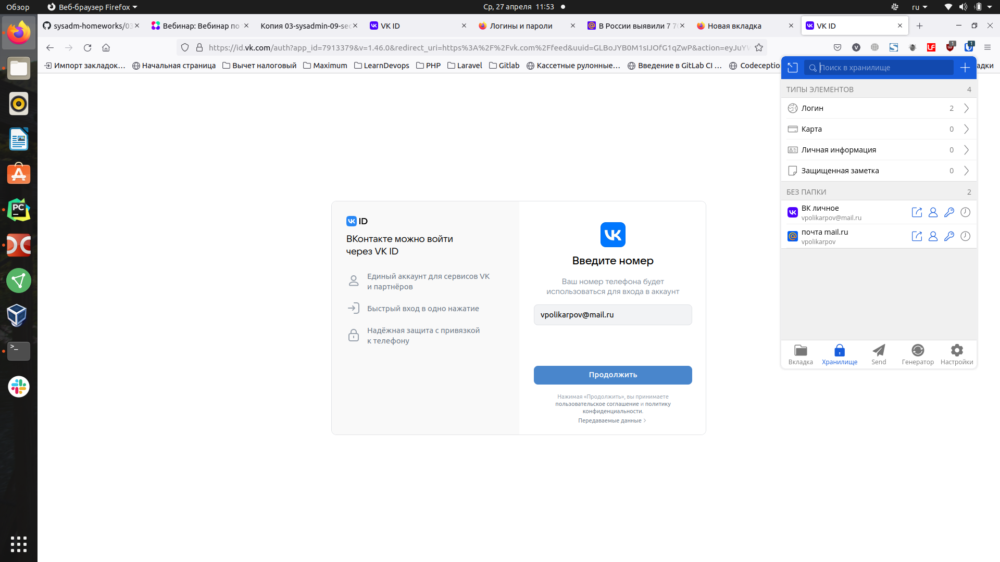
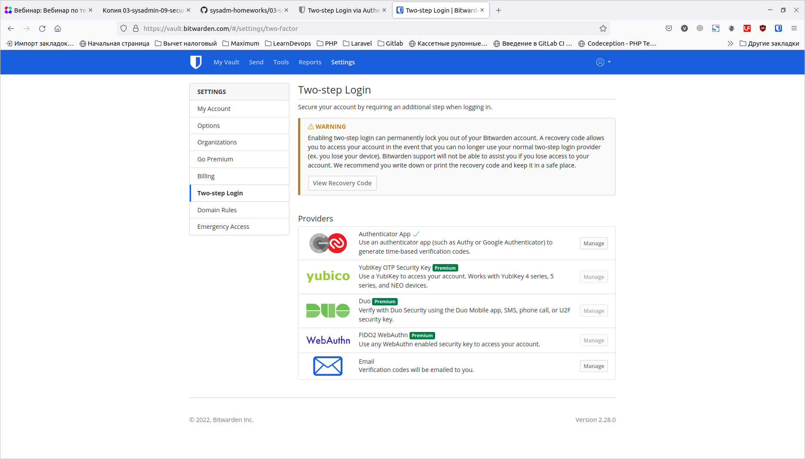
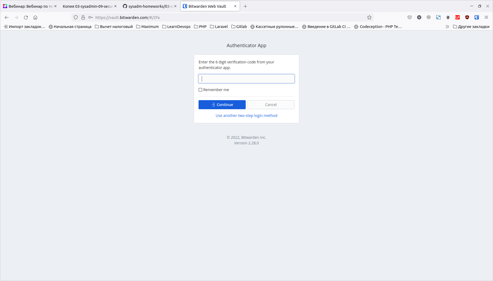
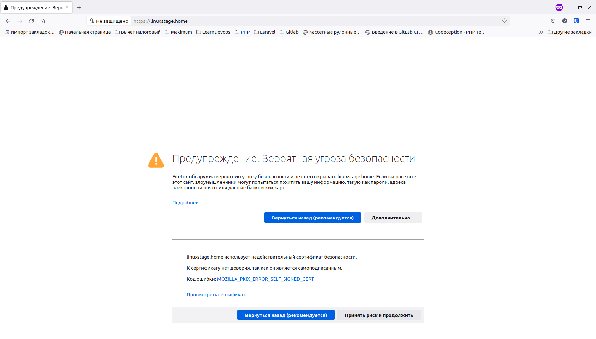
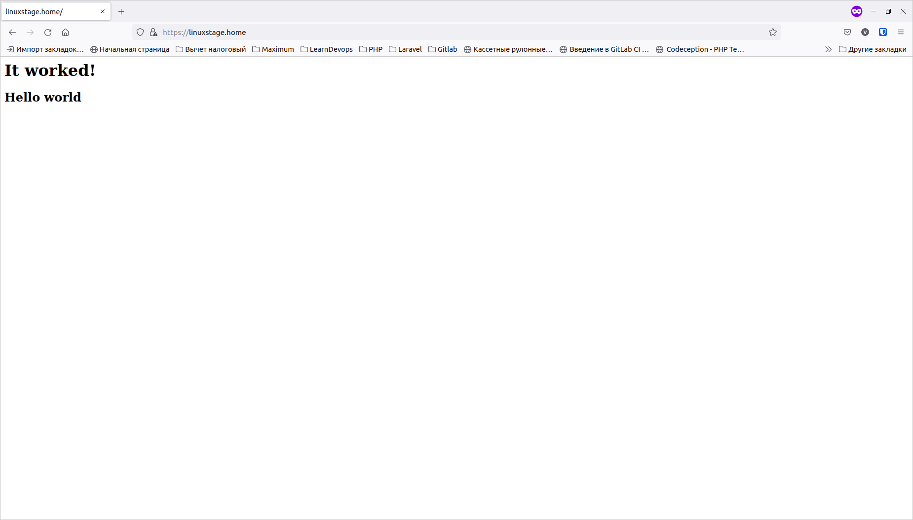
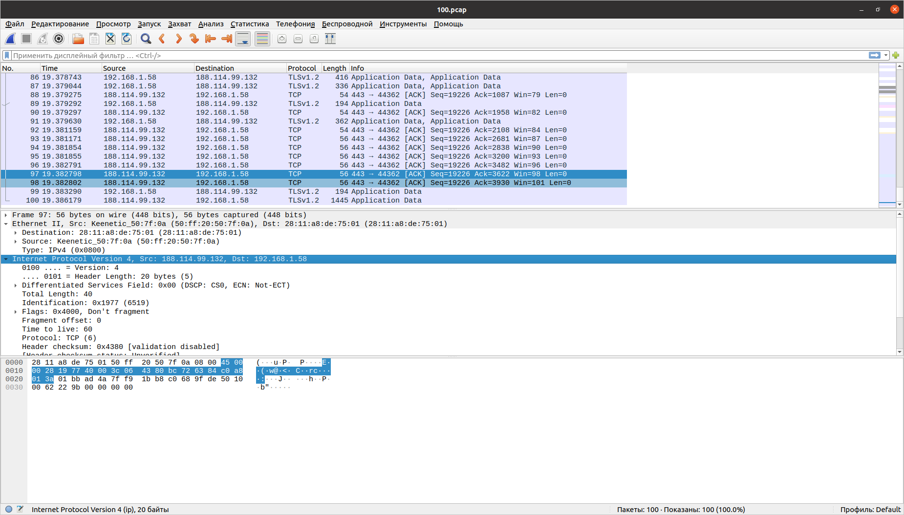

# Домашнее задание к занятию "3.9. Элементы безопасности информационных систем"

1. Установите Bitwarden плагин для браузера. Зарегестрируйтесь и сохраните несколько паролей.

Установил, добавил 2 логина c паролями от почты mail.ru и от ВК:


Со страницы входа в ВК плагин предлагает использовать сохраненный логин:



2. Установите Google authenticator на мобильный телефон. Настройте вход в Bitwarden акаунт через Google authenticator OTP.

Включил вход через Google authenticator:


При входе в аккаунт требуется ввести код из аутентификатора:


Сам аутентификатор не позволяет сделать скриншот на телефоне, когда запущен, прикладываю значок приложения с телефона:


3. Установите apache2, сгенерируйте самоподписанный сертификат, настройте тестовый сайт для работы по HTTPS.

apache2 установил:
```
vladimir@linuxstage:~/learndevops/devops-netology$ sudo systemctl status apache2
● apache2.service - The Apache HTTP Server
     Loaded: loaded (/lib/systemd/system/apache2.service; enabled; vendor preset: enabl>
     Active: active (running) since Wed 2022-04-27 12:20:44 MSK; 32min ago
       Docs: https://httpd.apache.org/docs/2.4/
    Process: 11343 ExecStart=/usr/sbin/apachectl start (code=exited, status=0/SUCCESS)
    Process: 12330 ExecReload=/usr/sbin/apachectl graceful (code=exited, status=0/SUCCE>
   Main PID: 11347 (apache2)
      Tasks: 55 (limit: 9216)
     Memory: 6.9M
     CGroup: /system.slice/apache2.service
             ├─11347 /usr/sbin/apache2 -k start
             ├─12334 /usr/sbin/apache2 -k start
             └─12335 /usr/sbin/apache2 -k start
```

Конфиг хоста:
```
vladimir@linuxstage:~/learndevops/devops-netology$ cat /etc/apache2/sites-available/linuxstage.home.conf 
<VirtualHost *:443>
	ServerName linuxstage.home
	DocumentRoot /var/www/linuxstage.home
	
	SSLEngine on
	SSlCertificateFile /etc/ssl/certs/apache-selfsigned.crt
	SSLCertificateKeyFile /etc/ssl/private/apache-selfsigned.key
</VirtualHost>
```

Код страницы сайта:

```
vladimir@linuxstage:~/learndevops/devops-netology$ cat /var/www/linuxstage.home/index.html 
<h1>It worked!</h1>
<h2>Hello world</h2>
```

Сертификат генерировал командой:

```
vladimir@linuxstage:~/learndevops/devops-netology$ sudo openssl req -x509 -nodes -days 365 -newkey rsa:2048 -keyout /etc/ssl/private/apache-selfsigned.key -out /etc/ssl/certs/apache-selfsigned.crt -subj "/C=RU/ST=Moscow/L=Moscow/O=Test company/OU=Org/CN=linuxstage.home"
```

Добавил домен linuxstage.home в файл /etc/hosts:

```
vladimir@linuxstage:~/learndevops/devops-netology$ cat /etc/hosts
127.0.0.1	localhost
127.0.1.1	linuxstage
127.0.0.1	linuxstage.home

# The following lines are desirable for IPv6 capable hosts
::1     ip6-localhost ip6-loopback
fe00::0 ip6-localnet
ff00::0 ip6-mcastprefix
ff02::1 ip6-allnodes
ff02::2 ip6-allrouters
```


Дополнительно было сообщение при тестировании настроек Апача:

```
vladimir@linuxstage:~/learndevops/devops-netology$ sudo apache2ctl configtest
AH00558: apache2: Could not reliably determine the server's fully qualified domain name, using 127.0.1.1. Set the 'ServerName' directive globally to suppress this message
Syntax OK
```
Это удалось решить, добавив в глобальный конфиг /etc/apache2/apache2.conf директиву ServerName localhost
 
После добавления проблема ушла:

```
vladimir@linuxstage:~/learndevops/devops-netology$ sudo apache2ctl configtest
Syntax OK
```

После настройки удается открыть сайт в браузере, но появляется предупреждение о самоподписанном сертификате:


Если принять предупреждение, сайт открывается:


4. Проверьте на TLS уязвимости произвольный сайт в интернете (кроме сайтов МВД, ФСБ, МинОбр, НацБанк, РосКосмос, РосАтом, РосНАНО и любых госкомпаний, объектов КИИ, ВПК ... и тому подобное).

Проверил на сайте https://www.nostalgic.ru:

```
vladimir@linuxstage:~/learndevops/testssl.sh$ ./testssl.sh -U --sneaky https://www.nostalgic.ru

###########################################################
    testssl.sh       3.1dev from https://testssl.sh/dev/
    (ab33f6c 2022-04-25 10:18:49 -- )

      This program is free software. Distribution and
             modification under GPLv2 permitted.
      USAGE w/o ANY WARRANTY. USE IT AT YOUR OWN RISK!

       Please file bugs @ https://testssl.sh/bugs/

###########################################################

 Using "OpenSSL 1.0.2-chacha (1.0.2k-dev)" [~183 ciphers]
 on linuxstage:./bin/openssl.Linux.x86_64
 (built: "Jan 18 17:12:17 2019", platform: "linux-x86_64")


 Start 2022-04-27 13:52:29        -->> 37.143.15.232:443 (www.nostalgic.ru) <<--

 rDNS (37.143.15.232):   www.nostalgic.ru.
 Service detected:       HTTP


 Testing vulnerabilities 

 Heartbleed (CVE-2014-0160)                not vulnerable (OK), timed out
 CCS (CVE-2014-0224)                       not vulnerable (OK)
 Ticketbleed (CVE-2016-9244), experiment.  not vulnerable (OK)
 ROBOT                                     not vulnerable (OK)
 Secure Renegotiation (RFC 5746)           supported (OK)
 Secure Client-Initiated Renegotiation     not vulnerable (OK)
 CRIME, TLS (CVE-2012-4929)                not vulnerable (OK)
 BREACH (CVE-2013-3587)                    potentially NOT ok, "gzip" HTTP compression detected. - only supplied "/" tested
                                           Can be ignored for static pages or if no secrets in the page
 POODLE, SSL (CVE-2014-3566)               not vulnerable (OK)
 TLS_FALLBACK_SCSV (RFC 7507)              Downgrade attack prevention supported (OK)
 SWEET32 (CVE-2016-2183, CVE-2016-6329)    not vulnerable (OK)
 FREAK (CVE-2015-0204)                     not vulnerable (OK)
 DROWN (CVE-2016-0800, CVE-2016-0703)      not vulnerable on this host and port (OK)
                                           make sure you don't use this certificate elsewhere with SSLv2 enabled services
                                           https://censys.io/ipv4?q=1C29F134C5D110376B19A149D8AE2F0EFB92F1B6C84D86DA6041C8B9387125B0 could help you to find out
 LOGJAM (CVE-2015-4000), experimental      not vulnerable (OK): no DH EXPORT ciphers, no DH key detected with <= TLS 1.2
 BEAST (CVE-2011-3389)                     TLS1: ECDHE-RSA-AES128-SHA
                                                 ECDHE-RSA-AES256-SHA AES256-SHA
                                                 AES128-SHA 
                                           VULNERABLE -- but also supports higher protocols  TLSv1.1 TLSv1.2 (likely mitigated)
 LUCKY13 (CVE-2013-0169), experimental     potentially VULNERABLE, uses cipher block chaining (CBC) ciphers with TLS. Check patches
 Winshock (CVE-2014-6321), experimental    not vulnerable (OK) - CAMELLIA or ECDHE_RSA GCM ciphers found
 RC4 (CVE-2013-2566, CVE-2015-2808)        no RC4 ciphers detected (OK)


 Done 2022-04-27 13:53:11 [  44s] -->> 37.143.15.232:443 (www.nostalgic.ru) <<--
```


5. Установите на Ubuntu ssh сервер, сгенерируйте новый приватный ключ. Скопируйте свой публичный ключ на другой сервер. Подключитесь к серверу по SSH-ключу.

Не удалось выполнить команду systemctl enable sshd.service, сообщает, что нет такого сервиса, получилось с sudo systemctl enable ssh.

Для подключения использовал свой личный vps-хостинг 37.143.15.232.

```
vladimir@linuxstage:~/learndevops/devops-netology/vagrant$ sudo apt install openssh-server
[sudo] пароль для vladimir: 
Чтение списков пакетов… Готово
Построение дерева зависимостей       
Чтение информации о состоянии… Готово
Следующие пакеты устанавливались автоматически и больше не требуются:
...
vladimir@linuxstage:~/learndevops/devops-netology/vagrant$ systemctl start sshd.service
vladimir@linuxstage:~/learndevops/devops-netology/vagrant$ systemctl enable sshd.serviceFailed to enable unit: Refusing to operate on alias name or linked unit file: sshd.service
vladimir@linuxstage:~/learndevops/devops-netology/vagrant$ sudo systemctl enable ssh
Synchronizing state of ssh.service with SysV service script with /lib/systemd/systemd-sysv-install.
Executing: /lib/systemd/systemd-sysv-install enable ssh
vladimir@linuxstage:~/learndevops/devops-netology/vagrant$ sudo systemctl status ssh
● ssh.service - OpenBSD Secure Shell server
     Loaded: loaded (/lib/systemd/system/ssh.service; enabled; vendor preset: enabled)
     Active: active (running) since Wed 2022-04-27 16:04:28 MSK; 23min ago
       Docs: man:sshd(8)
             man:sshd_config(5)
   Main PID: 26474 (sshd)
      Tasks: 1 (limit: 9216)
     Memory: 1.1M
     CGroup: /system.slice/ssh.service
             └─26474 sshd: /usr/sbin/sshd -D [listener] 0 of 10-100 startups

апр 27 16:04:28 linuxstage systemd[1]: Starting OpenBSD Secure Shell server...
апр 27 16:04:28 linuxstage sshd[26474]: Server listening on 0.0.0.0 port 22.
апр 27 16:04:28 linuxstage sshd[26474]: Server listening on :: port 22.
апр 27 16:04:28 linuxstage systemd[1]: Started OpenBSD Secure Shell server.
vladimir@linuxstage:~/learndevops/devops-netology/vagrant$ ssh-keygen
Generating public/private rsa key pair.
Enter file in which to save the key (/home/vladimir/.ssh/id_rsa): 
Enter passphrase (empty for no passphrase): 
Enter same passphrase again: 
Your identification has been saved in /home/vladimir/.ssh/id_rsa
Your public key has been saved in /home/vladimir/.ssh/id_rsa.pub
The key fingerprint is:
SHA256:c2/GidenAKK4z2aXESmtHazoWOdKs06qzd08d/SFqcw vladimir@linuxstage
The key's randomart image is:
+---[RSA 3072]----+
|                 |
|                 |
|       o .       |
|      . *        |
|     . =Soo  o   |
|    o.+.o+.=oo.  |
|   +=o.  *.oO.. .|
| o.=.B= + E+.. o |
|..+.*==+ .    .  |
+----[SHA256]-----+
vladimir@linuxstage:~/learndevops/devops-netology/vagrant$ ssh-copy-id www@37.143.15.232
The authenticity of host '37.143.15.232 (37.143.15.232)' can't be established.
ECDSA key fingerprint is SHA256:EOzSqW8fWd/kYuMwA6VB6/d+kuZDBPcgfifEptgEmH4.
Are you sure you want to continue connecting (yes/no/[fingerprint])? yes
/usr/bin/ssh-copy-id: INFO: attempting to log in with the new key(s), to filter out any that are already installed
/usr/bin/ssh-copy-id: INFO: 2 key(s) remain to be installed -- if you are prompted now it is to install the new keys
www@37.143.15.232's password: 

Number of key(s) added: 2

Now try logging into the machine, with:   "ssh 'www@37.143.15.232'"
and check to make sure that only the key(s) you wanted were added.

vladimir@linuxstage:~/learndevops/devops-netology/vagrant$ ssh 'www@37.143.15.232'
Last login: Wed Apr 27 16:19:47 2022 from 95.73.217.219
-bash-4.2$
```


 
6. Переименуйте файлы ключей из задания 5. Настройте файл конфигурации SSH клиента, так чтобы вход на удаленный сервер осуществлялся по имени сервера.

Файлы ключей переименовал:

```
vladimir@linuxstage:~/learndevops/devops-netology/vagrant$ mv ~/.ssh/id_rsa ~/.ssh/private_key
vladimir@linuxstage:~/learndevops/devops-netology/vagrant$ mv ~/.ssh/id_rsa.pub ~/.ssh/public_key
vladimir@linuxstage:~/learndevops/devops-netology/vagrant$ ls -la ~/.ssh/
итого 28
drwx------  2 vladimir vladimir 4096 апр 27 16:34 .
drwxr-xr-x 25 vladimir vladimir 4096 апр 24 14:55 ..
-rw-------  1 vladimir vladimir  411 мар 25 17:14 id_ed25519
-rw-r--r--  1 vladimir vladimir  103 мар 25 17:14 id_ed25519.pub
-rw-r--r--  1 vladimir vladimir 1332 апр 27 16:20 known_hosts
-rw-------  1 vladimir vladimir 2655 апр 27 16:07 private_key
-rw-r--r--  1 vladimir vladimir  573 апр 27 16:07 public_key
```

Создал папку и файл для конфига командами, как написано в презентации:
```
mkdir -p ~/.ssh && chmod 700 ~/.ssh
touch ~/.ssh/config && chmod 600 ~/.ssh/config
```
Заполнил файл конфига, перезапустил sshd, успешно подключился по имени хоста my_host, как настроено в конфиге:

```
vladimir@linuxstage:~/.ssh$ nano ~/.ssh/config 
vladimir@linuxstage:~/.ssh$ sudo systemctl restart sshd
vladimir@linuxstage:~/.ssh$ cat ~/.ssh/config 
Host my_host
  HostName 37.143.15.232
  IdentityFile ~/.ssh/private_key
  User www

vladimir@linuxstage:~/.ssh$ ssh my_host
Last login: Wed Apr 27 17:14:25 2022 from 95.73.217.219
-bash-4.2$ 
```

7. Соберите дамп трафика утилитой tcpdump в формате pcap, 100 пакетов. Откройте файл pcap в Wireshark.

Собрал дамп командой:

```
vladimir@linuxstage:~$ sudo tcpdump -w 100.pcap -c 100 -i wlp0s20f3
tcpdump: listening on wlp0s20f3, link-type EN10MB (Ethernet), capture size 262144 bytes
100 packets captured
278 packets received by filter
0 packets dropped by kernel
```

Открыл полученный файл 100.pcap в Wireshark:




