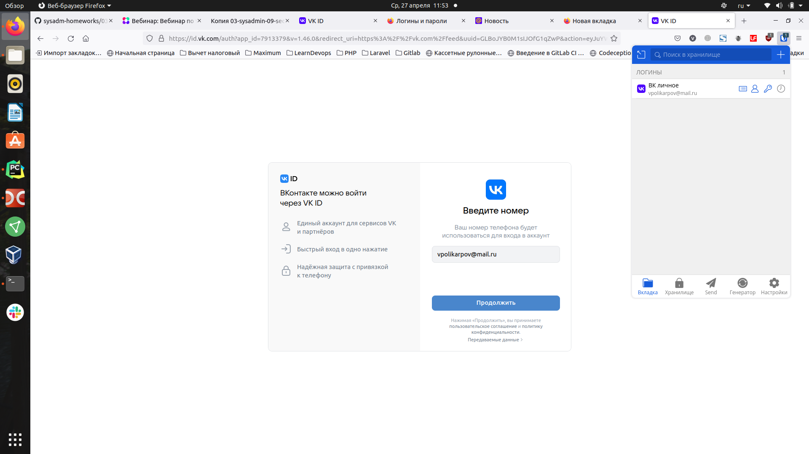
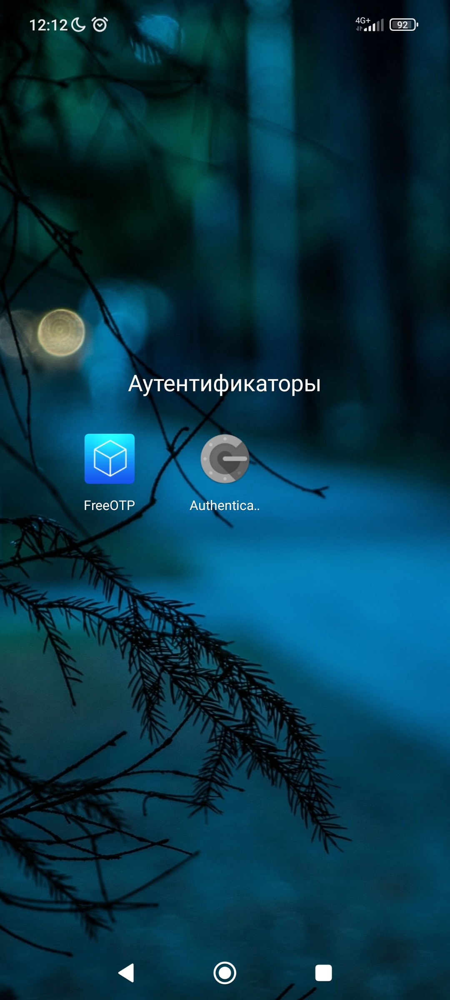

# Домашнее задание к занятию "3.9. Элементы безопасности информационных систем"

1. Установите Bitwarden плагин для браузера. Зарегестрируйтесь и сохраните несколько паролей.

Установил, добавил 2 логина c паролями от почты mail.ru и от ВК:



Со страницы входа в ВК плагин предлагает использовать сохраненный логин:


2. Установите Google authenticator на мобильный телефон. Настройте вход в Bitwarden акаунт через Google authenticator OTP.

Включил вход через Google authenticator:


Сам аутентификатор не позволяет сделать скриншот на телефоне, когда запущен, прикладываю значок приложения с телефона:


3. Установите apache2, сгенерируйте самоподписанный сертификат, настройте тестовый сайт для работы по HTTPS.

apache2 установил:
```
vladimir@linuxstage:~/learndevops/devops-netology$ sudo systemctl status apache2
● apache2.service - The Apache HTTP Server
     Loaded: loaded (/lib/systemd/system/apache2.service; enabled; vendor preset: enabl>
     Active: active (running) since Wed 2022-04-27 12:20:44 MSK; 32min ago
       Docs: https://httpd.apache.org/docs/2.4/
    Process: 11343 ExecStart=/usr/sbin/apachectl start (code=exited, status=0/SUCCESS)
    Process: 12330 ExecReload=/usr/sbin/apachectl graceful (code=exited, status=0/SUCCE>
   Main PID: 11347 (apache2)
      Tasks: 55 (limit: 9216)
     Memory: 6.9M
     CGroup: /system.slice/apache2.service
             ├─11347 /usr/sbin/apache2 -k start
             ├─12334 /usr/sbin/apache2 -k start
             └─12335 /usr/sbin/apache2 -k start
```

Конфиг хоста:
```
vladimir@linuxstage:~/learndevops/devops-netology$ cat /etc/apache2/sites-available/linuxstage.home.conf 
<VirtualHost *:443>
	ServerName linuxstage.home
	DocumentRoot /var/www/linuxstage.home
	
	SSLEngine on
	SSlCertificateFile /etc/ssl/certs/apache-selfsigned.crt
	SSLCertificateKeyFile /etc/ssl/private/apache-selfsigned.key
</VirtualHost>
```

Код страницы сайта:

```
vladimir@linuxstage:~/learndevops/devops-netology$ cat /var/www/linuxstage.home/index.html 
<h1>It worked!</h1>
<h2>Hello world</h2>
```

Сертификат генерировал командой:

```
vladimir@linuxstage:~/learndevops/devops-netology$ sudo openssl req -x509 -nodes -days 365 -newkey rsa:2048 -keyout /etc/ssl/private/apache-selfsigned.key -out /etc/ssl/certs/apache-selfsigned.crt -subj "/C=RU/ST=Moscow/L=Moscow/O=Test company/OU=Org/CN=linuxstage.home"
```

Добавил домен linuxstage.home в файл /etc/hosts:

```
vladimir@linuxstage:~/learndevops/devops-netology$ cat /etc/hosts
127.0.0.1	localhost
127.0.1.1	linuxstage
127.0.0.1	linuxstage.home

# The following lines are desirable for IPv6 capable hosts
::1     ip6-localhost ip6-loopback
fe00::0 ip6-localnet
ff00::0 ip6-mcastprefix
ff02::1 ip6-allnodes
ff02::2 ip6-allrouters
```


Дополнительно было сообщение при тестировании настроек Апача:

```
vladimir@linuxstage:~/learndevops/devops-netology$ sudo apache2ctl configtest
AH00558: apache2: Could not reliably determine the server's fully qualified domain name, using 127.0.1.1. Set the 'ServerName' directive globally to suppress this message
Syntax OK
```
Это удалось решить, добавив в глобальный конфиг /etc/apache2/apache2.conf директиву ServerName localhost
 
После добавления проблема ушла:

```
vladimir@linuxstage:~/learndevops/devops-netology$ sudo apache2ctl configtest
Syntax OK
```

После настройки удается открыть сайт в браузере, но появляется предупреждение о самоподписанном сертификате:


Если принять предупреждение, сайт открывается:


4. Проверьте на TLS уязвимости произвольный сайт в интернете (кроме сайтов МВД, ФСБ, МинОбр, НацБанк, РосКосмос, РосАтом, РосНАНО и любых госкомпаний, объектов КИИ, ВПК ... и тому подобное).

Проверил на сайте https://www.nostalgic.ru:

```
vladimir@linuxstage:~/learndevops/testssl.sh$ ./testssl.sh -U --sneaky https://www.nostalgic.ru

###########################################################
    testssl.sh       3.1dev from https://testssl.sh/dev/
    (ab33f6c 2022-04-25 10:18:49 -- )

      This program is free software. Distribution and
             modification under GPLv2 permitted.
      USAGE w/o ANY WARRANTY. USE IT AT YOUR OWN RISK!

       Please file bugs @ https://testssl.sh/bugs/

###########################################################

 Using "OpenSSL 1.0.2-chacha (1.0.2k-dev)" [~183 ciphers]
 on linuxstage:./bin/openssl.Linux.x86_64
 (built: "Jan 18 17:12:17 2019", platform: "linux-x86_64")


 Start 2022-04-27 13:52:29        -->> 37.143.15.232:443 (www.nostalgic.ru) <<--

 rDNS (37.143.15.232):   www.nostalgic.ru.
 Service detected:       HTTP


 Testing vulnerabilities 

 Heartbleed (CVE-2014-0160)                not vulnerable (OK), timed out
 CCS (CVE-2014-0224)                       not vulnerable (OK)
 Ticketbleed (CVE-2016-9244), experiment.  not vulnerable (OK)
 ROBOT                                     not vulnerable (OK)
 Secure Renegotiation (RFC 5746)           supported (OK)
 Secure Client-Initiated Renegotiation     not vulnerable (OK)
 CRIME, TLS (CVE-2012-4929)                not vulnerable (OK)
 BREACH (CVE-2013-3587)                    potentially NOT ok, "gzip" HTTP compression detected. - only supplied "/" tested
                                           Can be ignored for static pages or if no secrets in the page
 POODLE, SSL (CVE-2014-3566)               not vulnerable (OK)
 TLS_FALLBACK_SCSV (RFC 7507)              Downgrade attack prevention supported (OK)
 SWEET32 (CVE-2016-2183, CVE-2016-6329)    not vulnerable (OK)
 FREAK (CVE-2015-0204)                     not vulnerable (OK)
 DROWN (CVE-2016-0800, CVE-2016-0703)      not vulnerable on this host and port (OK)
                                           make sure you don't use this certificate elsewhere with SSLv2 enabled services
                                           https://censys.io/ipv4?q=1C29F134C5D110376B19A149D8AE2F0EFB92F1B6C84D86DA6041C8B9387125B0 could help you to find out
 LOGJAM (CVE-2015-4000), experimental      not vulnerable (OK): no DH EXPORT ciphers, no DH key detected with <= TLS 1.2
 BEAST (CVE-2011-3389)                     TLS1: ECDHE-RSA-AES128-SHA
                                                 ECDHE-RSA-AES256-SHA AES256-SHA
                                                 AES128-SHA 
                                           VULNERABLE -- but also supports higher protocols  TLSv1.1 TLSv1.2 (likely mitigated)
 LUCKY13 (CVE-2013-0169), experimental     potentially VULNERABLE, uses cipher block chaining (CBC) ciphers with TLS. Check patches
 Winshock (CVE-2014-6321), experimental    not vulnerable (OK) - CAMELLIA or ECDHE_RSA GCM ciphers found
 RC4 (CVE-2013-2566, CVE-2015-2808)        no RC4 ciphers detected (OK)


 Done 2022-04-27 13:53:11 [  44s] -->> 37.143.15.232:443 (www.nostalgic.ru) <<--
```


5. Установите на Ubuntu ssh сервер, сгенерируйте новый приватный ключ. Скопируйте свой публичный ключ на другой сервер. Подключитесь к серверу по SSH-ключу.
 
6. Переименуйте файлы ключей из задания 5. Настройте файл конфигурации SSH клиента, так чтобы вход на удаленный сервер осуществлялся по имени сервера.

7. Соберите дамп трафика утилитой tcpdump в формате pcap, 100 пакетов. Откройте файл pcap в Wireshark.


