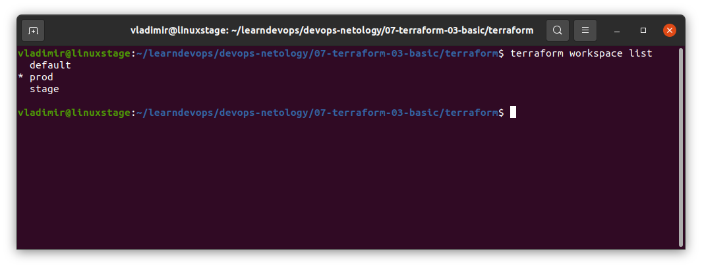
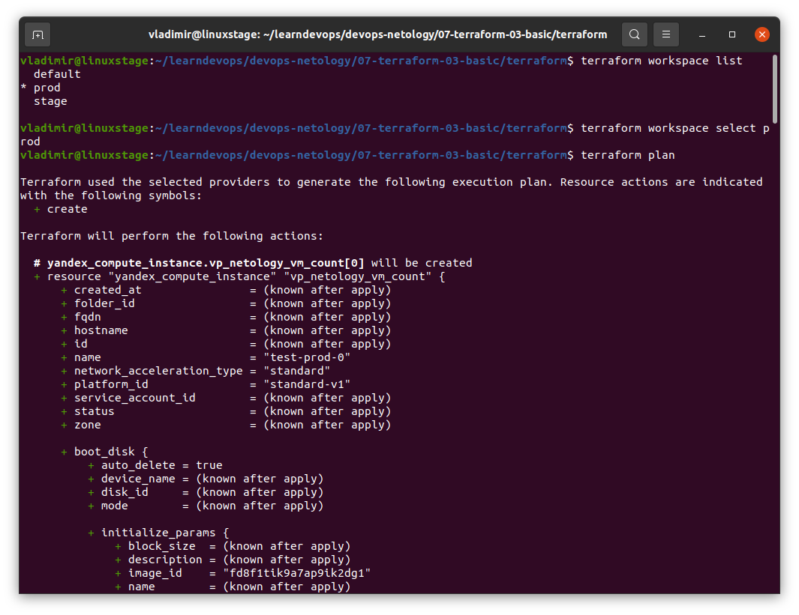

# Домашнее задание к занятию "7.3. Основы и принцип работы Терраформ"

## Задача 1. Создадим бэкэнд в S3 (необязательно, но крайне желательно).

Если в рамках предыдущего задания у вас уже есть аккаунт AWS, то давайте продолжим знакомство со взаимодействием
терраформа и aws. 

1. Создайте s3 бакет, iam роль и пользователя от которого будет работать терраформ. Можно создать отдельного пользователя,
а можно использовать созданного в рамках предыдущего задания, просто добавьте ему необходимы права, как описано 
[здесь](https://www.terraform.io/docs/backends/types/s3.html).
1. Зарегистрируйте бэкэнд в терраформ проекте как описано по ссылке выше. 

**Решение:**

Аккаунта AWS у меня нет, создать не получается по понятным причинам, поэтому все задания делал в Яндекс Облаке.
Создал там бакет, служебный аккаунт и ключ для него. Прописал настройки для бэкэнда в файле backend.tf, который поместил под .gitignore, так как в нем нужно передавать секретный ключ. При попытке передать ключ через переменные и окружение столкнулся с ошибками, что переменные нельзя указывать в этом блоке.

Структура файла такая:

```
terraform {
  backend "s3" {
    endpoint   = "storage.yandexcloud.net"
    bucket     = "vp-bucket"
    region     = "ru-central1-a"
    key        = "terraform/terraform.tfstate"
    access_key = "<id ключа>"
    secret_key = "<секретный ключ>"

    skip_region_validation      = true
    skip_credentials_validation = true
  }
}
```

Далее этот бэкэнд использовался при работе в задаче 2.

## Задача 2. Инициализируем проект и создаем воркспейсы. 

1. Выполните `terraform init`:
    * если был создан бэкэнд в S3, то терраформ создат файл стейтов в S3 и запись в таблице 
dynamodb.
    * иначе будет создан локальный файл со стейтами.  
1. Создайте два воркспейса `stage` и `prod`.
1. В уже созданный `aws_instance` добавьте зависимость типа инстанса от вокспейса, что бы в разных ворскспейсах 
использовались разные `instance_type`.
1. Добавим `count`. Для `stage` должен создаться один экземпляр `ec2`, а для `prod` два. 
1. Создайте рядом еще один `aws_instance`, но теперь определите их количество при помощи `for_each`, а не `count`.
1. Что бы при изменении типа инстанса не возникло ситуации, когда не будет ни одного инстанса добавьте параметр
жизненного цикла `create_before_destroy = true` в один из рессурсов `aws_instance`.
1. При желании поэкспериментируйте с другими параметрами и рессурсами.

В виде результата работы пришлите:
* Вывод команды `terraform workspace list`.
* Вывод команды `terraform plan` для воркспейса `prod`.  

**Решение:**

В виде результата работы пришлите:
* Вывод команды `terraform workspace list`.



* Вывод команды `terraform plan` для воркспейса `prod`.  



Вывод команды слишком длинный, записал его в лог-файл: 

[terraform_plan.log](./terraform/terraform_plan.log)

[Ссылка на исходники для Терраформа в этом же репозитории](./terraform)


