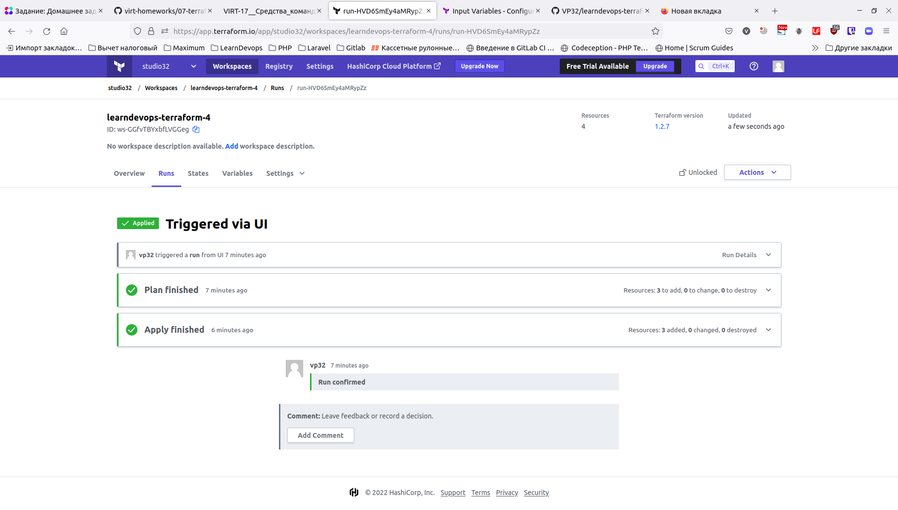

# Домашнее задание к занятию "7.4. Средства командной работы над инфраструктурой."

## Задача 1. Настроить terraform cloud (необязательно, но крайне желательно).

В это задании предлагается познакомиться со средством командой работы над инфраструктурой предоставляемым
разработчиками терраформа. 

1. Зарегистрируйтесь на [https://app.terraform.io/](https://app.terraform.io/).
(регистрация бесплатная и не требует использования платежных инструментов).
1. Создайте в своем github аккаунте (или другом хранилище репозиториев) отдельный репозиторий с
 конфигурационными файлами прошлых занятий (или воспользуйтесь любым простым конфигом).
1. Зарегистрируйте этот репозиторий в [https://app.terraform.io/](https://app.terraform.io/).
1. Выполните plan и apply. 

В качестве результата задания приложите снимок экрана с успешным применением конфигурации.

**Решение:**

Создал репозиторий с простым планом для Терраформа: [https://github.com/VP32/learndevops-terraform-4](https://github.com/VP32/learndevops-terraform-4).
Зарегистрировал его в Terraform Cloud. Применил план из веб-интерфейса:

Стриггерил применение плана, сделав push в ветку main:

## Задача 2. Написать серверный конфиг для атлантиса. 

Смысл задания – познакомиться с документацией 
о [серверной](https://www.runatlantis.io/docs/server-side-repo-config.html) конфигурации и конфигурации уровня 
 [репозитория](https://www.runatlantis.io/docs/repo-level-atlantis-yaml.html).

Создай `server.yaml` который скажет атлантису:
1. Укажите, что атлантис должен работать только для репозиториев в вашем github (или любом другом) аккаунте.
1. На стороне клиентского конфига разрешите изменять `workflow`, то есть для каждого репозитория можно 
будет указать свои дополнительные команды. 
1. В `workflow` используемом по-умолчанию сделайте так, что бы во время планирования не происходил `lock` состояния.

Создай `atlantis.yaml` который, если поместить в корень terraform проекта, скажет атлантису:
1. Надо запускать планирование и аплай для двух воркспейсов `stage` и `prod`.
1. Необходимо включить автопланирование при изменении любых файлов `*.tf`.

В качестве результата приложите ссылку на файлы `server.yaml` и `atlantis.yaml`.

**Решение:**

Ссылки на файлы:

 - [server.yaml](https://github.com/VP32/learndevops-terraform-4/blob/main/server.yaml)
 - [atlantis.yaml](https://github.com/VP32/learndevops-terraform-4/blob/main/atlantis.yaml) 

## Задача 3. Знакомство с каталогом модулей. 

1. В [каталоге модулей](https://registry.terraform.io/browse/modules) найдите официальный модуль от aws для создания
`ec2` инстансов. 
2. Изучите как устроен модуль. Задумайтесь, будете ли в своем проекте использовать этот модуль или непосредственно 
ресурс `aws_instance` без помощи модуля?
3. В рамках предпоследнего задания был создан ec2 при помощи ресурса `aws_instance`. 
Создайте аналогичный инстанс при помощи найденного модуля.   

В качестве результата задания приложите ссылку на созданный блок конфигураций. 

**Решение:**

Ранее мне не удавалось создать аккаунт для AWS, делал все в Яндекс облаке. Нашел на выходных свой старый пробный аккаунт, созданный 6 лет назад, удалось прикрутить к нему казахскую карту для оплаты, для быстрых экспериментов подойдет.:) Ничего бесплатного в аккаунте уже не осталось. Для экспериментов создал простой инстанс через aws_instance, и простой инстанс через модуль ec2_instance.

Думаю, в простых случаях я бы создавал инстанс напрямую через aws_instance. В случаях, требующих настройки большого числа параметров у инстанса, использовал бы модуль. С другой стороны, может потребоваться такая конфигурация, которая не покрывается настройками модуля. В этом случае возвращаемся к aws_instance.

Ссылка на конфигурацию:

[main.tf](./terraform/main.tf)
[versions.tf](./terraform/versions.tf)
