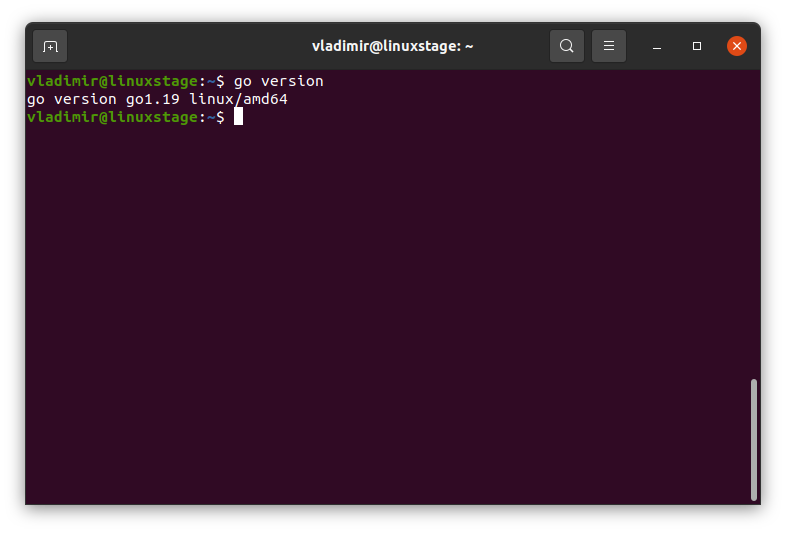

# Домашнее задание к занятию "7.5. Основы golang"

С `golang` в рамках курса, мы будем работать не много, поэтому можно использовать любой IDE. 
Но рекомендуем ознакомиться с [GoLand](https://www.jetbrains.com/ru-ru/go/).  

## Задача 1. Установите golang.
1. Воспользуйтесь инструкций с официального сайта: [https://golang.org/](https://golang.org/).
2. Так же для тестирования кода можно использовать песочницу: [https://play.golang.org/](https://play.golang.org/).

**Решение:**

Установил по инструкции с официального сайта: [https://golang.org/]. Установил IDE Goland.



## Задача 2. Знакомство с gotour.
У Golang есть обучающая интерактивная консоль [https://tour.golang.org/](https://tour.golang.org/). 
Рекомендуется изучить максимальное количество примеров. В консоли уже написан необходимый код, 
осталось только с ним ознакомиться и поэкспериментировать как написано в инструкции в левой части экрана.  

**Решение:**

Ознакомился с консолью и примерами, посмотрел несколько уроков.

## Задача 3. Написание кода. 
Цель этого задания закрепить знания о базовом синтаксисе языка. Можно использовать редактор кода 
на своем компьютере, либо использовать песочницу: [https://play.golang.org/](https://play.golang.org/).

1. Напишите программу для перевода метров в футы (1 фут = 0.3048 метр). Можно запросить исходные данные 
у пользователя, а можно статически задать в коде.
    Для взаимодействия с пользователем можно использовать функцию `Scanf`:
    ```
    package main
    
    import "fmt"
    
    func main() {
        fmt.Print("Enter a number: ")
        var input float64
        fmt.Scanf("%f", &input)
    
        output := input * 2
    
        fmt.Println(output)    
    }
    ```
 
1. Напишите программу, которая найдет наименьший элемент в любом заданном списке, например:
    ```
    x := []int{48,96,86,68,57,82,63,70,37,34,83,27,19,97,9,17,}
    ```
1. Напишите программу, которая выводит числа от 1 до 100, которые делятся на 3. То есть `(3, 6, 9, …)`.

В виде решения ссылку на код или сам код. 

**Решение:**

Написал общую программу, код разнес по функциям:

```
package main

import (
	"fmt"
)

const FootToMeterCoeff float64 = 0.3048

func main() {
	// 3.1. Напишите программу для перевода метров в футы (1 фут = 0.3048 метр).
	fmt.Print("Введите метры: ")
	var input float64
	fmt.Scanf("%f", &input)
	fmt.Printf("Метры в футы: %f\n", MeterToFoot(input))

	// 3.2. Напишите программу, которая найдет наименьший элемент в любом заданном списке, например:
	// x := []int{48, 96, 86, 68, 57, 82, 63, 70, 37, 34, 83, 27, 19, 97, 9, 17}
	x := []int{48, 96, 86, 68, 57, 82, 63, 70, 37, 34, 83, 27, 19, 97, 9, 17, 4, 8, 15, 23, 42}
	fmt.Printf("Минимальный элемент: %d\n", MinElement(x))

	// 3.3. Напишите программу, которая выводит числа от 1 до 100, которые делятся на 3. То есть (3, 6, 9, …).
	fmt.Printf("Числа, которые делятся на 3: %v\n", Div3())
}

// 3.1. Напишите программу для перевода метров в футы (1 фут = 0.3048 метр).
func MeterToFoot(input float64) float64 {
	output := input / FootToMeterCoeff
	return output
}

// 3.2. Напишите программу, которая найдет наименьший элемент в любом заданном списке
func MinElement(list []int) int {
	min := list[0]
	for _, elem := range list {
		if elem < min {
			min = elem
		}
	}

	return min
}

// 3.3. Напишите программу, которая выводит числа от 1 до 100, которые делятся на 3. То есть (3, 6, 9, …).
func Div3() []int {
	result := []int{}
	for i := 1; i <= 100; i++ {
		if i%3 == 0 {
			result = append(result, i)
		}
	}

	return result
}
```

## Задача 4. Протестировать код (не обязательно).

Создайте тесты для функций из предыдущего задания. 

**Решение:**

Написал тесты для функций:

```
package main

import (
	"math/rand"
	"testing"
)

// Задача 4. Протестировать код (не обязательно).
// Тест для программы для перевода метров в футы
func TestMeterToFoot(t *testing.T) {
	meter := rand.Float64() * 100
	expected := meter / FootToMeterCoeff
	fact := MeterToFoot(meter)
	if expected != fact {
		t.Error("Expected ", expected, ", got ", fact)
	}
}

// Тест для программы, которая найдет наименьший элемент в любом заданном списке
func TestMinElement(t *testing.T) {
	x := []int{7, 999, 2, 1}
	expected := 1
	fact := MinElement(x)

	if expected != fact {
		t.Error("Expected ", expected, ", got ", fact)
	}
}

// Тест для программы, которая выводит числа от 1 до 100, которые делятся на 3.
func TestDiv3(t *testing.T) {
	expected := []int{3, 6, 9, 12, 15, 18, 21, 24, 27, 30, 33, 36, 39, 42, 45, 48, 51, 54, 57, 60, 63, 66, 69, 72, 75, 78, 81, 84, 87, 90, 93, 96, 99}
	fact := Div3()

	if len(expected) != len(fact) {
		t.Error("Wrong result length")
	}

	for k, v := range fact {
		if v != expected[k] {
			t.Error("Expected ", expected[k], ", got ", v)
		}
	}
}
```

Исходники в этом же репозитории: [src](./src/vpgo)

