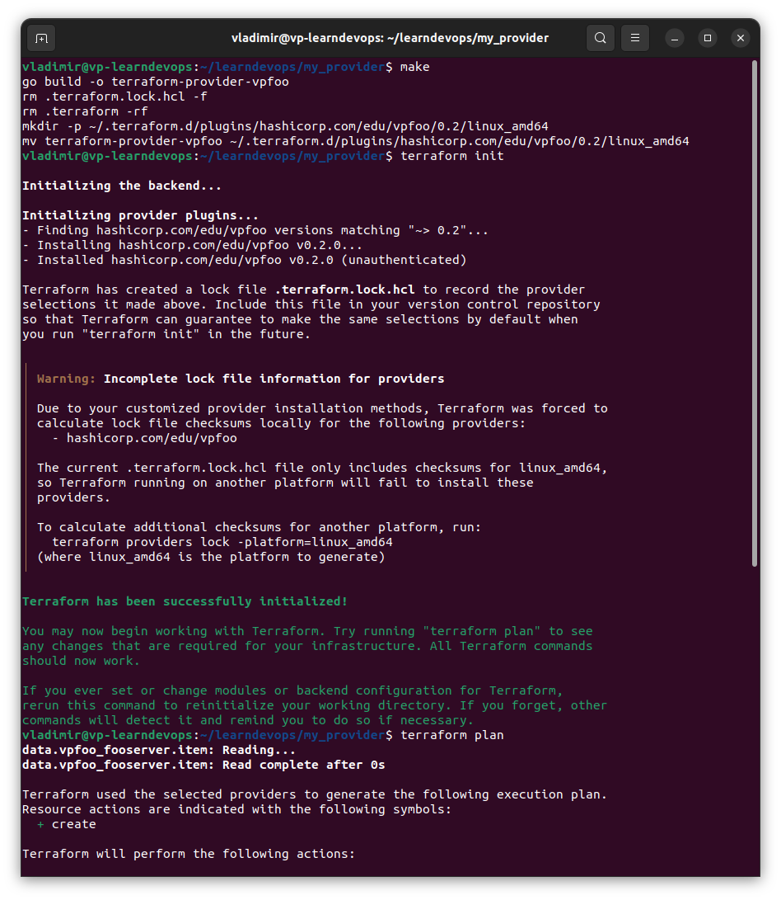
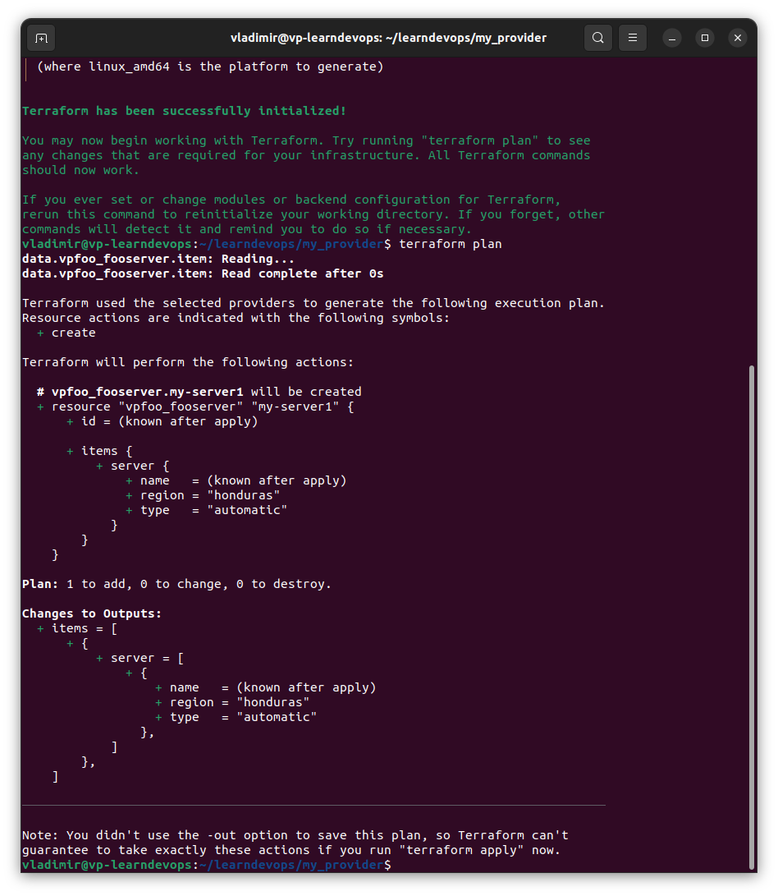

# Домашнее задание к занятию "7.6. Написание собственных провайдеров для Terraform."

Бывает, что 
* общедоступная документация по терраформ ресурсам не всегда достоверна,
* в документации не хватает каких-нибудь правил валидации или неточно описаны параметры,
* понадобиться использовать провайдер без официальной документации,
* может возникнуть необходимость написать свой провайдер для системы используемой в ваших проектах.   

## Задача 1. 
Давайте потренируемся читать исходный код AWS провайдера, который можно склонировать от сюда: 
[https://github.com/hashicorp/terraform-provider-aws.git](https://github.com/hashicorp/terraform-provider-aws.git).
Просто найдите нужные ресурсы в исходном коде и ответы на вопросы станут понятны.  


1. Найдите, где перечислены все доступные `resource` и `data_source`, приложите ссылку на эти строки в коде на 
гитхабе.   

**Решение:**

* все `data_source` перечислены тут: [Github](https://github.com/hashicorp/terraform-provider-aws/blob/71d1fa399fd77b60db8f64c94e89a8020742cb1b/internal/provider/provider.go#L414)

* все `resource` перечислены тут: [Github](https://github.com/hashicorp/terraform-provider-aws/blob/71d1fa399fd77b60db8f64c94e89a8020742cb1b/internal/provider/provider.go#L923)

2. Для создания очереди сообщений SQS используется ресурс `aws_sqs_queue` у которого есть параметр `name`. 
    * С каким другим параметром конфликтует `name`? Приложите строчку кода, в которой это указано.
    * Какая максимальная длина имени? 
    * Какому регулярному выражению должно подчиняться имя? 

**Решение:**

   * конфликтует с параметром `name_prefix`, указано тут: [Github](https://github.com/hashicorp/terraform-provider-aws/blob/71d1fa399fd77b60db8f64c94e89a8020742cb1b/internal/service/sqs/queue.go#L87)
   * Максимальная длина имени равна 80 символам. Имя может состоять из комбинации  name_prefix и name, к которым в случае, если атрибут fifo_queue = true, может быть добавлен суффикс ".fifo": [Github](https://github.com/hashicorp/terraform-provider-aws/blob/71d1fa399fd77b60db8f64c94e89a8020742cb1b/internal/service/sqs/queue.go#L424)
   * В случае, если атрибут fifo_queue = true, регулярное выражение `^[a-zA-Z0-9_-]{1,75}\.fifo$`. Иначе - `^[a-zA-Z0-9_-]{1,80}$`: [Github](https://github.com/hashicorp/terraform-provider-aws/blob/71d1fa399fd77b60db8f64c94e89a8020742cb1b/internal/service/sqs/queue.go#L424)
    

## Задача 2. (Не обязательно) 
В рамках вебинара и презентации мы разобрали как создать свой собственный провайдер на примере кофемашины. 
Также вот официальная документация о создании провайдера: 
[https://learn.hashicorp.com/collections/terraform/providers](https://learn.hashicorp.com/collections/terraform/providers).

1. Проделайте все шаги создания провайдера.
2. В виде результата приложение ссылку на исходный код.
3. Попробуйте скомпилировать провайдер, если получится то приложите снимок экрана с командой и результатом компиляции.   


**Решение:**

Сделал "муляж" для провайдера без реальной интеграции с API. Провайдер компилируется, устанавливается в локальную систему и позволяет выполнить команды `terraform init` и `terraform plan`. За основу взял boilerplate-ветку репозитория с кофе-машиной от Hashicorp с помощью команды `git clone --branch boilerplate https://github.com/hashicorp/terraform-provider-hashicups`
В качестве API, с которым предполагалась (но не успел сделать) интеграцию, хотел использовать тестовое апи, которое нам показали на лекции: https://gitlab.com/k11s-os/custom-terraform-provider/demo-resource-microservice

Ссылка на провайдера, который я сделал: https://github.com/VP32/test-terraform-provider

Вывод команд на компиляцию,  `terraform init` и `terraform plan`:

```
vladimir@vp-learndevops:~/learndevops/my_provider$ make
go build -o terraform-provider-vpfoo
rm .terraform.lock.hcl -f
rm .terraform -rf
mkdir -p ~/.terraform.d/plugins/hashicorp.com/edu/vpfoo/0.2/linux_amd64
mv terraform-provider-vpfoo ~/.terraform.d/plugins/hashicorp.com/edu/vpfoo/0.2/linux_amd64
vladimir@vp-learndevops:~/learndevops/my_provider$ terraform init

Initializing the backend...

Initializing provider plugins...
- Finding hashicorp.com/edu/vpfoo versions matching "~> 0.2"...
- Installing hashicorp.com/edu/vpfoo v0.2.0...
- Installed hashicorp.com/edu/vpfoo v0.2.0 (unauthenticated)

Terraform has created a lock file .terraform.lock.hcl to record the provider
selections it made above. Include this file in your version control repository
so that Terraform can guarantee to make the same selections by default when
you run "terraform init" in the future.

╷
│ Warning: Incomplete lock file information for providers
│ 
│ Due to your customized provider installation methods, Terraform was forced to
│ calculate lock file checksums locally for the following providers:
│   - hashicorp.com/edu/vpfoo
│ 
│ The current .terraform.lock.hcl file only includes checksums for linux_amd64,
│ so Terraform running on another platform will fail to install these
│ providers.
│ 
│ To calculate additional checksums for another platform, run:
│   terraform providers lock -platform=linux_amd64
│ (where linux_amd64 is the platform to generate)
╵

Terraform has been successfully initialized!

You may now begin working with Terraform. Try running "terraform plan" to see
any changes that are required for your infrastructure. All Terraform commands
should now work.

If you ever set or change modules or backend configuration for Terraform,
rerun this command to reinitialize your working directory. If you forget, other
commands will detect it and remind you to do so if necessary.
vladimir@vp-learndevops:~/learndevops/my_provider$ terraform plan
data.vpfoo_fooserver.item: Reading...
data.vpfoo_fooserver.item: Read complete after 0s

Terraform used the selected providers to generate the following execution plan.
Resource actions are indicated with the following symbols:
  + create

Terraform will perform the following actions:

  # vpfoo_fooserver.my-server1 will be created
  + resource "vpfoo_fooserver" "my-server1" {
      + id = (known after apply)

      + items {
          + server {
              + name   = (known after apply)
              + region = "honduras"
              + type   = "automatic"
            }
        }
    }

Plan: 1 to add, 0 to change, 0 to destroy.

Changes to Outputs:
  + items = [
      + {
          + server = [
              + {
                  + name   = (known after apply)
                  + region = "honduras"
                  + type   = "automatic"
                },
            ]
        },
    ]

───────────────────────────────────────────────────────────────────────────────

Note: You didn't use the -out option to save this plan, so Terraform can't
guarantee to take exactly these actions if you run "terraform apply" now.
```






