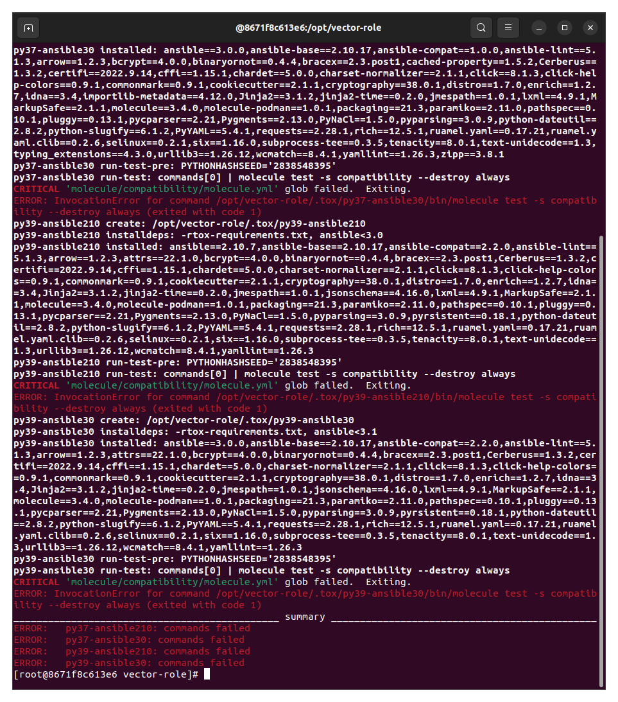
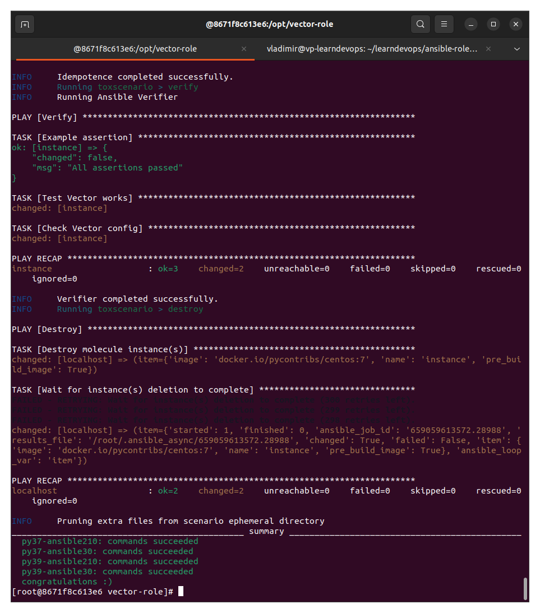

# Домашнее задание к занятию "08.05 Тестирование Roles"

## Подготовка к выполнению
1. Установите molecule: `pip3 install "molecule==3.5.2"`
2. Выполните `docker pull aragast/netology:latest` -  это образ с podman, tox и несколькими пайтонами (3.7 и 3.9) внутри

## Основная часть

Наша основная цель - настроить тестирование наших ролей. Задача: сделать сценарии тестирования для vector. Ожидаемый результат: все сценарии успешно проходят тестирование ролей.

### Molecule

1. Запустите  `molecule test -s centos8` внутри корневой директории clickhouse-role, посмотрите на вывод команды.

**Примечание**

Использовал роль https://github.com/AlexeySetevoi/ansible-clickhouse

Командой   `molecule test -s centos8` запустить тесты не удалось, так как не было сценария centos8. Получилось через centos_8:

```
vladimir@vp-learndevops:~/learndevops/ansible-clickhouse$ molecule test -s centos8
CRITICAL 'molecule/centos8/molecule.yml' glob failed.  Exiting.
vladimir@vp-learndevops:~/learndevops/ansible-clickhouse$ molecule test -s centos_8
INFO     centos_8 scenario test matrix: dependency, lint, cleanup, destroy, syntax, create, prepare, converge, idempotence, side_effect, verify, cleanup, destroy
INFO     Performing prerun...
INFO     Set ANSIBLE_LIBRARY=/home/vladimir/.cache/ansible-compat/b9a93c/modules:/home/vladimir/.ansible/plugins/modules:/usr/share/ansible/plugins/modules
INFO     Set ANSIBLE_COLLECTIONS_PATH=/home/vladimir/.cache/ansible-compat/b9a93c/collections:/home/vladimir/.ansible/collections:/usr/share/ansible/collections
INFO     Set ANSIBLE_ROLES_PATH=/home/vladimir/.cache/ansible-compat/b9a93c/roles:/home/vladimir/.ansible/roles:/usr/share/ansible/roles:/etc/ansible/roles
INFO     Inventory /home/vladimir/learndevops/ansible-clickhouse/molecule/centos_8/../resources/inventory/hosts.yml linked to /home/vladimir/.cache/molecule/ansible-clickhouse/centos_8/inventory/hosts
INFO     Inventory /home/vladimir/learndevops/ansible-clickhouse/molecule/centos_8/../resources/inventory/group_vars/ linked to /home/vladimir/.cache/molecule/ansible-clickhouse/centos_8/inventory/group_vars
INFO     Inventory /home/vladimir/learndevops/ansible-clickhouse/molecule/centos_8/../resources/inventory/host_vars/ linked to /home/vladimir/.cache/molecule/ansible-clickhouse/centos_8/inventory/host_vars
INFO     Running centos_8 > dependency
INFO     Running ansible-galaxy collection install -v community.docker:>=1.9.1
WARNING  Skipping, missing the requirements file.
WARNING  Skipping, missing the requirements file.
INFO     Inventory /home/vladimir/learndevops/ansible-clickhouse/molecule/centos_8/../resources/inventory/hosts.yml linked to /home/vladimir/.cache/molecule/ansible-clickhouse/centos_8/inventory/hosts
INFO     Inventory /home/vladimir/learndevops/ansible-clickhouse/molecule/centos_8/../resources/inventory/group_vars/ linked to /home/vladimir/.cache/molecule/ansible-clickhouse/centos_8/inventory/group_vars
INFO     Inventory /home/vladimir/learndevops/ansible-clickhouse/molecule/centos_8/../resources/inventory/host_vars/ linked to /home/vladimir/.cache/molecule/ansible-clickhouse/centos_8/inventory/host_vars
INFO     Running centos_8 > lint
COMMAND: yamllint .
ansible-lint
flake8

WARNING: PATH altered to include /usr/bin
WARNING  Loading custom .yamllint config file, this extends our internal yamllint config.
WARNING  Listing 1 violation(s) that are fatal
risky-file-permissions: File permissions unset or incorrect
tasks/install/apt.yml:45 Task/Handler: Hold specified version during APT upgrade | Package installation

You can skip specific rules or tags by adding them to your configuration file:
# .ansible-lint
warn_list:  # or 'skip_list' to silence them completely
  - experimental  # all rules tagged as experimental

Finished with 0 failure(s), 1 warning(s) on 56 files.
/bin/bash: строка 3: flake8: команда не найдена
CRITICAL Lint failed with error code 127
WARNING  An error occurred during the test sequence action: 'lint'. Cleaning up.
INFO     Inventory /home/vladimir/learndevops/ansible-clickhouse/molecule/centos_8/../resources/inventory/hosts.yml linked to /home/vladimir/.cache/molecule/ansible-clickhouse/centos_8/inventory/hosts
INFO     Inventory /home/vladimir/learndevops/ansible-clickhouse/molecule/centos_8/../resources/inventory/group_vars/ linked to /home/vladimir/.cache/molecule/ansible-clickhouse/centos_8/inventory/group_vars
INFO     Inventory /home/vladimir/learndevops/ansible-clickhouse/molecule/centos_8/../resources/inventory/host_vars/ linked to /home/vladimir/.cache/molecule/ansible-clickhouse/centos_8/inventory/host_vars
INFO     Running centos_8 > cleanup
WARNING  Skipping, cleanup playbook not configured.
INFO     Inventory /home/vladimir/learndevops/ansible-clickhouse/molecule/centos_8/../resources/inventory/hosts.yml linked to /home/vladimir/.cache/molecule/ansible-clickhouse/centos_8/inventory/hosts
INFO     Inventory /home/vladimir/learndevops/ansible-clickhouse/molecule/centos_8/../resources/inventory/group_vars/ linked to /home/vladimir/.cache/molecule/ansible-clickhouse/centos_8/inventory/group_vars
INFO     Inventory /home/vladimir/learndevops/ansible-clickhouse/molecule/centos_8/../resources/inventory/host_vars/ linked to /home/vladimir/.cache/molecule/ansible-clickhouse/centos_8/inventory/host_vars
INFO     Running centos_8 > destroy
INFO     Sanity checks: 'docker'

PLAY [Destroy] *****************************************************************

TASK [Destroy molecule instance(s)] ********************************************
changed: [localhost] => (item=centos_8)

TASK [Wait for instance(s) deletion to complete] *******************************
FAILED - RETRYING: [localhost]: Wait for instance(s) deletion to complete (300 retries left).
ok: [localhost] => (item=centos_8)

TASK [Delete docker networks(s)] ***********************************************

PLAY RECAP *********************************************************************
localhost                  : ok=2    changed=1    unreachable=0    failed=0    skipped=1    rescued=0    ignored=0

INFO     Pruning extra files from scenario ephemeral directory
vladimir@vp-learndevops:~/learndevops/ansible-clickhouse$ 
```


2. Перейдите в каталог с ролью vector-role и создайте сценарий тестирования по умолчанию при помощи `molecule init scenario --driver-name docker`.
3. Добавьте несколько разных дистрибутивов (centos:8, ubuntu:latest) для инстансов и протестируйте роль, исправьте найденные ошибки, если они есть.
4. Добавьте несколько assert'ов в verify.yml файл для  проверки работоспособности vector-role (проверка, что конфиг валидный, проверка успешности запуска, etc). Запустите тестирование роли повторно и проверьте, что оно прошло успешно.
5. Добавьте новый тег на коммит с рабочим сценарием в соответствии с семантическим версионированием.

**Решение**

Ссылка на тег с коммитом с рабочим сценарием: https://github.com/VP32/vector-role/releases/tag/1.1.0

Использовал следующие платформы для тестирования роли:
 - docker.io/pycontribs/fedora:latest
 - docker.io/pycontribs/centos:7

В verify.yml использовал проверки через shell: что запускается команда `vector --version`, и что конфиг по умолчанию Vector валиден.

### Tox

1. Добавьте в директорию с vector-role файлы из [директории](./example)
2. Запустите `docker run --privileged=True -v <path_to_repo>:/opt/vector-role -w /opt/vector-role -it aragast/netology:latest /bin/bash`, где path_to_repo - путь до корня репозитория с vector-role на вашей файловой системе.
3. Внутри контейнера выполните команду `tox`, посмотрите на вывод.

**Примечание**
Получил ошибки, так как нет сценария compatibility:



5. Создайте облегчённый сценарий для `molecule` с драйвером `molecule_podman`. Проверьте его на исполнимость.
6. Пропишите правильную команду в `tox.ini` для того чтобы запускался облегчённый сценарий.
8. Запустите команду `tox`. Убедитесь, что всё отработало успешно.
9. Добавьте новый тег на коммит с рабочим сценарием в соответствии с семантическим версионированием.

После выполнения у вас должно получится два сценария molecule и один tox.ini файл в репозитории. Ссылка на репозиторий являются ответами на домашнее задание. Не забудьте указать в ответе теги решений Tox и Molecule заданий.

**Решение**

Ссылка на тег с коммитом по Molecule + Tox: https://github.com/VP32/vector-role/releases/tag/1.2.0

Для Tox я добавил сценарий toxscenario.
При попытке запустить Tox, используя драйвер podman в сценарии, столкнулся с ошибкой из Подмана: _Error: invalid config provided: cannot set hostname when running in the host UTS namespace: invalid configuration_

Я ранее не работал с Подманом, стал гуглить по описанию ошибки и нашел такое решение:
https://github.com/containers/podman/issues/11969#issuecomment-943386484

Удалил из файла /etc/containers/containers.conf строки 
`netns="host"`
и
`utsns="host"`, тогда tox отработал:




