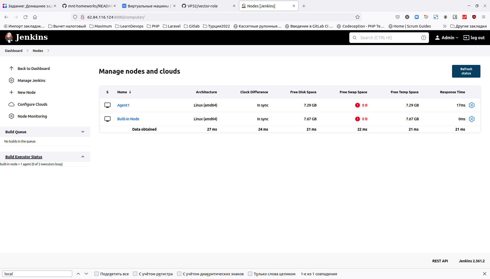
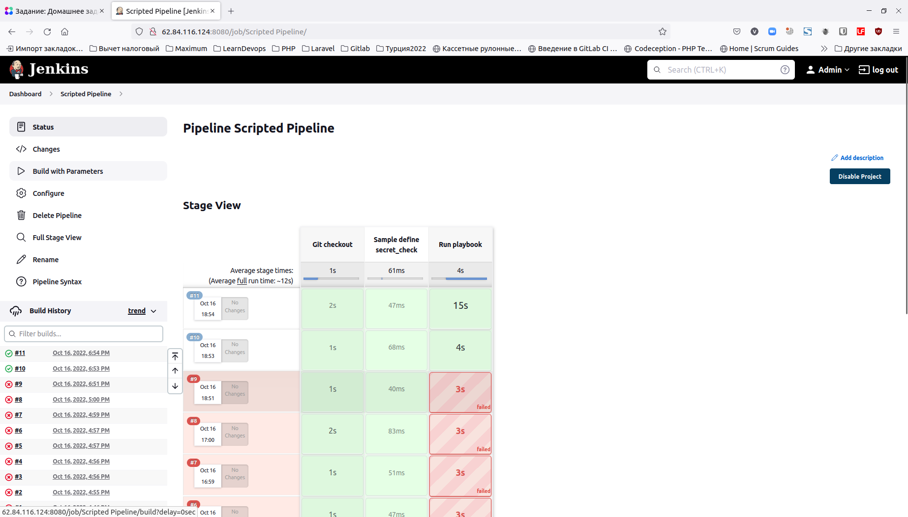
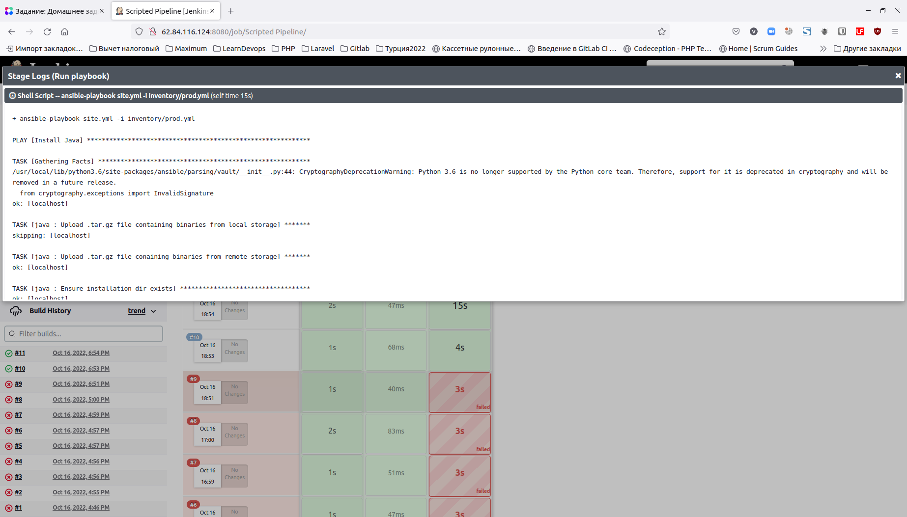
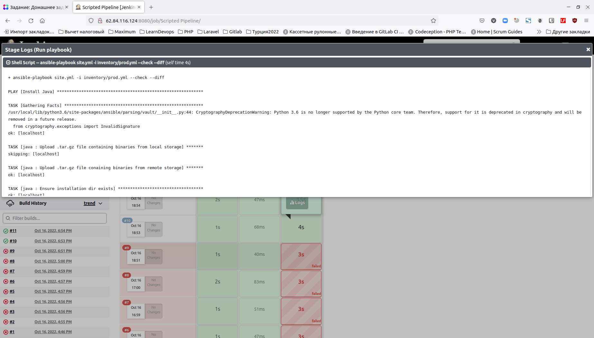

# Домашнее задание к занятию "09.04 Jenkins"

## Подготовка к выполнению

1. Создать 2 VM: для jenkins-master и jenkins-agent.
2. Установить jenkins при помощи playbook'a.
3. Запустить и проверить работоспособность.
4. Сделать первоначальную настройку.

**Решение:**

Развернул VM в Яндекс облаке с помощью плана Terraform, находящегося в папке [terraform](./terraform).

Вписал ip-адреса машин и пользователя centos в файл [inventory](./infrastructure/inventory/cicd/hosts.yml).

Запустил playbook, все отработало корректно.

Настроил Jenkins:
 - провел первоначальную настройку и установку плагинов
 - сделал 0 executer-ов на мастере Jenkins
 - добавил агента



## Основная часть

1. Сделать Freestyle Job, который будет запускать `molecule test` из любого вашего репозитория с ролью.
2. Сделать Declarative Pipeline Job, который будет запускать `molecule test` из любого вашего репозитория с ролью.
3. Перенести Declarative Pipeline в репозиторий в файл `Jenkinsfile`.
4. Создать Multibranch Pipeline на запуск `Jenkinsfile` из репозитория.
5. Создать Scripted Pipeline, наполнить его скриптом из [pipeline](./pipeline).
6. Внести необходимые изменения, чтобы Pipeline запускал `ansible-playbook` без флагов `--check --diff`, если не установлен параметр при запуске джобы (prod_run = True), по умолчанию параметр имеет значение False и запускает прогон с флагами `--check --diff`.
7. Проверить работоспособность, исправить ошибки, исправленный Pipeline вложить в репозиторий в файл `ScriptedJenkinsfile`.
8. Отправить ссылку на репозиторий с ролью и Declarative Pipeline и Scripted Pipeline.

**Решение:**

Использовал свой репозиторий с ролью из предыдущих заданий для пунктов 1-4: https://github.com/VP32/vector-role/tree/main

Столкнулся с проблемой, которая затронула также пункты 2-4. Вероятно, проблема в исходном плейбуке, данном в задании, самостоятельно ее разрешить у меня не получилось: команда `molecule test` падает на следующем пункте:

```
19:38:24 TASK [Wait for instance(s) creation to complete] *******************************
19:38:25 failed: [localhost] (item={'started': 1, 'finished': 0, 'ansible_job_id': '80191961888.28235', 'results_file': '/home/jenkins/.ansible_async/80191961888.28235', 'changed': True, 'failed': False, 'item': {'image': 'docker.io/pycontribs/centos:7', 'name': 'c7', 'pre_build_image': True}, 'ansible_loop_var': 'item'}) => {"ansible_job_id": "80191961888.28235", "ansible_loop_var": "item", "attempts": 1, "changed": false, "finished": 1, "item": {"ansible_job_id": "80191961888.28235", "ansible_loop_var": "item", "changed": true, "failed": false, "finished": 0, "item": {"image": "docker.io/pycontribs/centos:7", "name": "c7", "pre_build_image": true}, "results_file": "/home/jenkins/.ansible_async/80191961888.28235", "started": 1}, "msg": "Unsupported parameters for (community.docker.docker_container) module: command_handling Supported parameters include: api_version, auto_remove, blkio_weight, ca_cert, cap_drop, capabilities, cgroup_parent, cleanup, client_cert, client_key, command, comparisons, container_default_behavior ...
```

Это воспроизводилось на разных ролях, не только на моей.

По пунктам 5-7 воспользовался рекомендацией из статьи https://www.shellhacks.com/ansible-sudo-a-password-is-required/: Method #4: Disable Sudo Password for Ansible User

В итоге появилась следующая, новая ошибка: 

```
TASK [java : Extract java in the installation directory] ***********************
An exception occurred during task execution. To see the full traceback, use -vvv. The error was: NoneType: None
fatal: [localhost]: FAILED! => {"changed": false, "msg": "dest '/opt/jdk/openjdk-11' must be an existing dir"}
```

По-видимому, нужно доработать плейбук из задания, чтобы он проверял создание директории /opt/jdk/openjdk-11. После ручного создания этой папки пайплайн отработал:



Запуск с проставленным чекбоксом prod_run:



Запуск с не проставленным чекбоксом prod_run:




 - Репозиторий с ролью: https://github.com/VP32/vector-role/tree/main

 - [Jenkinsfile c Declarative Pipeline](https://github.com/VP32/vector-role/blob/01d0c8aa6db2abb6d4c4d76c42fd0af599014aa7/Jenkinsfile)
 - [Scripted Pipeline](https://github.com/VP32/vector-role/blob/01d0c8aa6db2abb6d4c4d76c42fd0af599014aa7/ScriptedJenkinsfile)