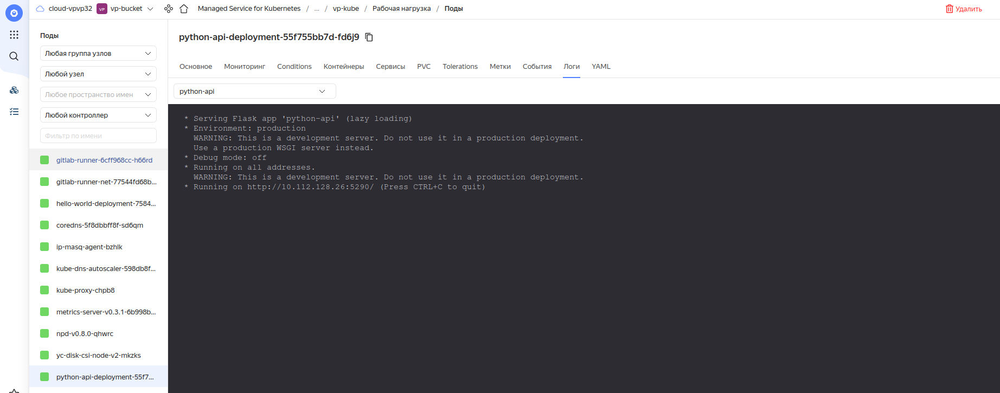

# Домашнее задание к занятию "09.06 Gitlab"

## Подготовка к выполнению

1. Необходимо [подготовить gitlab к работе по инструкции](https://cloud.yandex.ru/docs/tutorials/infrastructure-management/gitlab-containers)
2. Создайте свой новый проект
3. Создайте новый репозиторий в gitlab, наполните его [файлами](./repository)
4. Проект должен быть публичным, остальные настройки по желанию

**Решение**

1. Настроил Gitlab и кластер Kubernetes по [инструкции](https://cloud.yandex.ru/docs/tutorials/infrastructure-management/gitlab-containers).

Настроил пробный проект из этой инструкции. Пайплайн прошел после нескольких неудачных попыток и последующих донастроек:

2-4. Создал новый проект, добавил туда указанный файл:

## Основная часть

### DevOps

В репозитории содержится код проекта на python. Проект - RESTful API сервис. Ваша задача автоматизировать сборку образа с выполнением python-скрипта:
1. Образ собирается на основе [centos:7](https://hub.docker.com/_/centos?tab=tags&page=1&ordering=last_updated)
2. Python версии не ниже 3.7
3. Установлены зависимости: `flask` `flask-restful`
4. Создана директория `/python_api`
5. Скрипт из репозитория размещён в /python_api
6. Точка вызова: запуск скрипта
7. Если сборка происходит на ветке `master`: должен подняться pod kubernetes на основе образа `python-api`, иначе этот шаг нужно пропустить

**Решение**

Настроил проект и пайплайн:

Репозиторий: https://vlpol.gitlab.yandexcloud.net/vp-group/netology

Пайплайн отработал:

Образ Docker появился в репозитории в Яндекс Облаке:

Под с приложением поднялся:

### Product Owner

Вашему проекту нужна бизнесовая доработка: необходимо поменять JSON ответа на вызов метода GET `/rest/api/get_info`, необходимо создать Issue в котором указать:
1. Какой метод необходимо исправить
2. Текст с `{ "message": "Already started" }` на `{ "message": "Running"}`
3. Issue поставить label: feature

**Решение**

Ссылка на Issue: [https://vlpol.gitlab.yandexcloud.net/vp-group/netology/-/issues/1](https://vlpol.gitlab.yandexcloud.net/vp-group/netology/-/issues/1)

### Developer

Вам пришел новый Issue на доработку, вам необходимо:
1. Создать отдельную ветку, связанную с этим issue
2. Внести изменения по тексту из задания
3. Подготовить Merge Requst, влить необходимые изменения в `master`, проверить, что сборка прошла успешно

**Решение**

Merge Requst: [https://vlpol.gitlab.yandexcloud.net/vp-group/netology/-/merge_requests/1](https://vlpol.gitlab.yandexcloud.net/vp-group/netology/-/merge_requests/1)

### Tester

Разработчики выполнили новый Issue, необходимо проверить валидность изменений:
1. Поднять докер-контейнер с образом `python-api:latest` и проверить возврат метода на корректность
2. Закрыть Issue с комментарием об успешности прохождения, указав желаемый результат и фактически достигнутый

**Решение**

Пересобран и поднят контейнер с актуальным образом, проверена корректность возврата метода:

## Итог

После успешного прохождения всех ролей - отправьте ссылку на ваш проект в гитлаб, как решение домашнего задания

### :bangbang: Не забудьте оставить GitLab рабочим после выполнения задания и погасить все ресурсы в Yandex.Cloud сразу после получения зачета по домашнему заданию.

**Итоговый проект:**  https://vlpol.gitlab.yandexcloud.net/vp-group/netology

