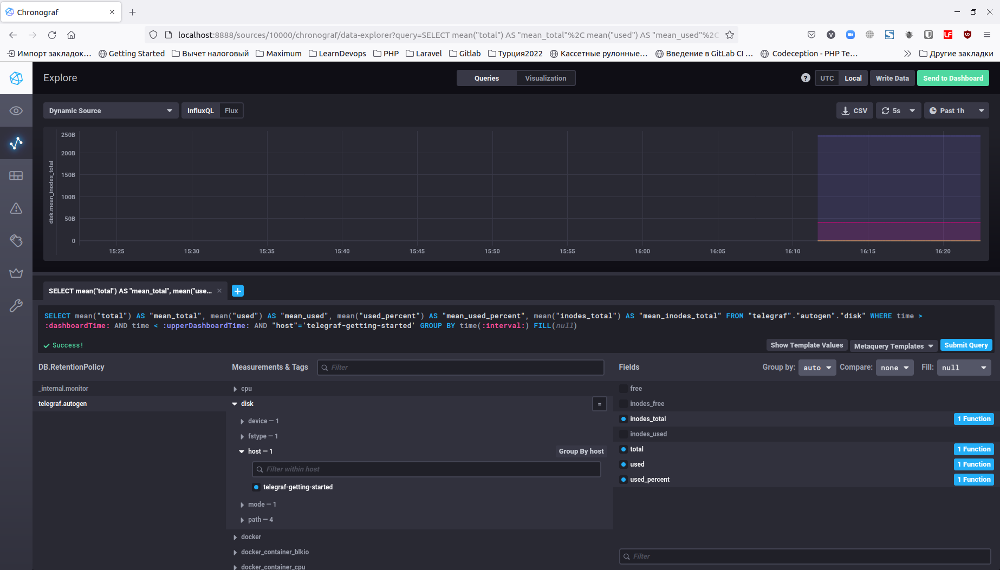

# Домашнее задание к занятию "10.02. Системы мониторинга"

## Обязательные задания

1. Опишите основные плюсы и минусы pull и push систем мониторинга.

**Ответ:**

**Push:**

Плюсы:

 - За счет того, что отправка данных настраивается на клиенте, подключение новой ноды не требует донастройки сервера.
 - Настройка отправки данных на клиенте может быть сделана более гибко: мы можем настроить объем и частоту отправки индивидуально для каждого клиента.
 - С одного клиента можно отправлять данные в несколько систем мониторинга.
 - При отправке с помощью UDP-протокола может вырасти производительность сбора метрик, т.к. менее затратный протокол.

Минусы:

 - При использовании UDP-протокола не гарантируется доставка данных с клиента
 - Можем получить данные, которые не планировали получать - за счет того, что подключение настраивается только со стороны клиента, может подключиться какой-то неожиданный клиент
 - Сервер может быть перегружен запросами со множества клиентов
 - Нет единой централизованной конфигурации с настройками клиентов

**Pull:**

Плюсы:

- Возможность настройки TLS-соединений с агентами, защита трафика
- Можно настроить единый proxy-сервер для всех агентов.
- Единая точка настройки конфигурации мониторинга.
- Не перегрузим сервер, т.к. он может забирать данные, когда для этого есть свободные ресурсы.
- Гарантия подлинности данных - опрашиваем только те агенты, которые зарегистрированы в системе.

Минусы:

- Менее производительная система за счет работы на TCP-протоколе.
- Неудобно использовать для динамических машин, таких как докер-контейнеры.
- Для подключения новой ноды нужно менять конфигурацию на сервере.
- Сложно организовать репликацию данных между разными системами мониторинга.


2. Какие из ниже перечисленных систем относятся к push модели, а какие к pull? А может есть гибридные?

    - Prometheus 
    - TICK
    - Zabbix
    - VictoriaMetrics
    - Nagios

**Ответ:**

- Prometheus - pull-модель, но с помощью PushGateway возможно подключение метрик с систем, работающих по push-модели, например для заданий cron
- TICK - push-модель
- Zabbix - гибридная система, работает по push и pull-моделям
- VictoriaMetrics - гибридная система, работает по push и pull-моделям
- Nagios - pull-модель

3. Склонируйте себе [репозиторий](https://github.com/influxdata/sandbox/tree/master) и запустите TICK-стэк, 
используя технологии docker и docker-compose.(по инструкции ./sandbox up )

В виде решения на это упражнение приведите выводы команд с вашего компьютера (виртуальной машины):

    - curl http://localhost:8086/ping
    - curl http://localhost:8888
    - curl http://localhost:9092/kapacitor/v1/ping

А также скриншот веб-интерфейса ПО chronograf (`http://localhost:8888`). 

P.S.: если при запуске некоторые контейнеры будут падать с ошибкой - проставьте им режим `Z`, например
`./data:/var/lib:Z`

**Решение:**

```
vladimir@VP32Hard:~/learndevops/monitoring/sandbox$ curl http://localhost:8086/ping -v
*   Trying 127.0.0.1:8086...
* Connected to localhost (127.0.0.1) port 8086 (#0)
> GET /ping HTTP/1.1
> Host: localhost:8086
> User-Agent: curl/7.81.0
> Accept: */*
> 
* Mark bundle as not supporting multiuse
< HTTP/1.1 204 No Content
< Content-Type: application/json
< Request-Id: e41e5f79-5843-11ed-8044-0242ac120003
< X-Influxdb-Build: OSS
< X-Influxdb-Version: 1.8.10
< X-Request-Id: e41e5f79-5843-11ed-8044-0242ac120003
< Date: Sun, 30 Oct 2022 11:13:33 GMT
< 
* Connection #0 to host localhost left intact
vladimir@VP32Hard:~/learndevops/monitoring/sandbox$ curl http://localhost:8888 -v
*   Trying 127.0.0.1:8888...
* Connected to localhost (127.0.0.1) port 8888 (#0)
> GET / HTTP/1.1
> Host: localhost:8888
> User-Agent: curl/7.81.0
> Accept: */*
> 
* Mark bundle as not supporting multiuse
< HTTP/1.1 200 OK
< Accept-Ranges: bytes
< Cache-Control: public, max-age=3600
< Content-Length: 414
< Content-Security-Policy: script-src 'self'; object-src 'self'
< Content-Type: text/html; charset=utf-8
< Etag: ubyGAbz3Tc69bqd3w45d4WQtqoI=
< Vary: Accept-Encoding
< X-Chronograf-Version: 1.10.0
< X-Content-Type-Options: nosniff
< X-Frame-Options: SAMEORIGIN
< X-Xss-Protection: 1; mode=block
< Date: Sun, 30 Oct 2022 11:13:40 GMT
< 
* Connection #0 to host localhost left intact
<!DOCTYPE html><html><head><link rel="stylesheet" href="/index.c708214f.css"><meta http-equiv="Content-type" content="text/html; charset=utf-8"><title>Chronograf</title><link rel="icon shortcut" href="/favicon.70d63073.ico"></head><body> <div id="react-root" data-basepath=""></div> <script type="module" src="/index.e81b88ee.js"></script><script src="/index.a6955a67.js" nomodule="" defer></script> </body></html>vladimir@VP32Hard:~/learndevops/monitoring/sandbox$ curl http://localhost:9092/kapacitor/v1curl http://localhost:9092/kapacitor/v1/ping -v
*   Trying 127.0.0.1:9092...
* Connected to localhost (127.0.0.1) port 9092 (#0)
> GET /kapacitor/v1/ping HTTP/1.1
> Host: localhost:9092
> User-Agent: curl/7.81.0
> Accept: */*
> 
* Mark bundle as not supporting multiuse
< HTTP/1.1 204 No Content
< Content-Type: application/json; charset=utf-8
< Request-Id: eef74094-5843-11ed-8036-0242ac120005
< X-Kapacitor-Version: 1.6.5
< Date: Sun, 30 Oct 2022 11:13:51 GMT
< 
* Connection #0 to host localhost left intact
vladimir@VP32Hard:~/learndevops/monitoring/sandbox$ curl http://localhost:9092/kapacitor/v1/ping -v
*   Trying 127.0.0.1:9092...
* Connected to localhost (127.0.0.1) port 9092 (#0)
> GET /kapacitor/v1/ping HTTP/1.1
> Host: localhost:9092
> User-Agent: curl/7.81.0
> Accept: */*
> 
* Mark bundle as not supporting multiuse
< HTTP/1.1 204 No Content
< Content-Type: application/json; charset=utf-8
< Request-Id: 765b1e34-585b-11ed-826a-0242ac140005
< X-Kapacitor-Version: 1.6.5
< Date: Sun, 30 Oct 2022 14:02:16 GMT
< 
* Connection #0 to host localhost left intact
vladimir@VP32Hard:~/learndevops/monitoring/sandbox$ 
```


4. Изучите список [telegraf inputs](https://github.com/influxdata/telegraf/tree/master/plugins/inputs).
    - Добавьте в конфигурацию telegraf плагин - [disk](https://github.com/influxdata/telegraf/tree/master/plugins/inputs/disk):
    ```
    [[inputs.disk]]
      ignore_fs = ["tmpfs", "devtmpfs", "devfs", "iso9660", "overlay", "aufs", "squashfs"]
    ```
    - Так же добавьте в конфигурацию telegraf плагин - [mem](https://github.com/influxdata/telegraf/tree/master/plugins/inputs/mem):
    ```
    [[inputs.mem]]
    ```
    - После настройки перезапустите telegraf.
 
    - Перейдите в веб-интерфейс Chronograf (`http://localhost:8888`) и откройте вкладку `Data explorer`.
    - Нажмите на кнопку `Add a query`
    - Изучите вывод интерфейса и выберите БД `telegraf.autogen`
    - В `measurments` выберите mem->host->telegraf_container_id , а в `fields` выберите used_percent. 
    Внизу появится график утилизации оперативной памяти в контейнере telegraf.
    - Вверху вы можете увидеть запрос, аналогичный SQL-синтаксису. 
    Поэкспериментируйте с запросом, попробуйте изменить группировку и интервал наблюдений.
    - Приведите скриншот с отображением
    метрик утилизации места на диске (disk->host->telegraf_container_id) из веб-интерфейса.  

**Решение:**

Добавил плагин disk и mem.

Метрики памяти:


Метрики диска:



5. Добавьте в конфигурацию telegraf следующий плагин - [docker](https://github.com/influxdata/telegraf/tree/master/plugins/inputs/docker):
```
[[inputs.docker]]
  endpoint = "unix:///var/run/docker.sock"
```

Дополнительно вам может потребоваться донастройка контейнера telegraf в `docker-compose.yml` дополнительного volume и 
режима privileged:
```
  telegraf:
    image: telegraf:1.4.0
    privileged: true
    volumes:
      - ./etc/telegraf.conf:/etc/telegraf/telegraf.conf:Z
      - /var/run/docker.sock:/var/run/docker.sock:Z
    links:
      - influxdb
    ports:
      - "8092:8092/udp"
      - "8094:8094"
      - "8125:8125/udp"
```

После настройки перезапустите telegraf, обновите веб интерфейс и приведите скриншотом список `measurments` в 
веб-интерфейсе базы telegraf.autogen . Там должны появиться метрики, связанные с docker.

Факультативно можете изучить какие метрики собирает telegraf после выполнения данного задания.

**Решение:**

Плагин docker уже был добавлен в конфигурацию Telegraf из коробки:


Поэтому метрики для docker уже доступны:


## Дополнительное задание (со звездочкой*) - необязательно к выполнению

В веб-интерфейсе откройте вкладку `Dashboards`. Попробуйте создать свой dashboard с отображением:

    - утилизации ЦПУ
    - количества использованного RAM
    - утилизации пространства на дисках
    - количество поднятых контейнеров
    - аптайм
    - ...
    - фантазируйте)
    
    ---

**Решение:**

Создал свой пробный дашборд:


