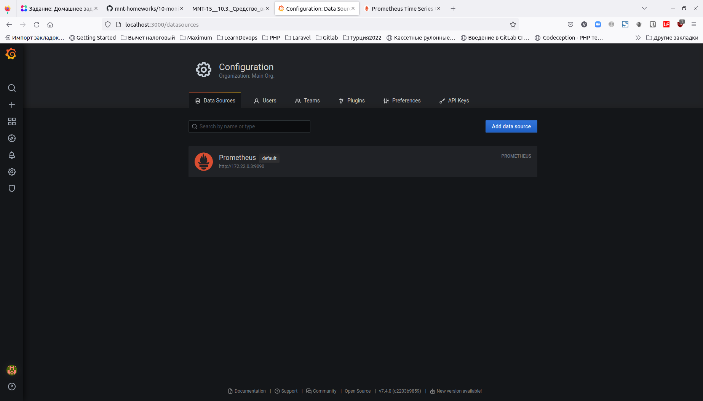
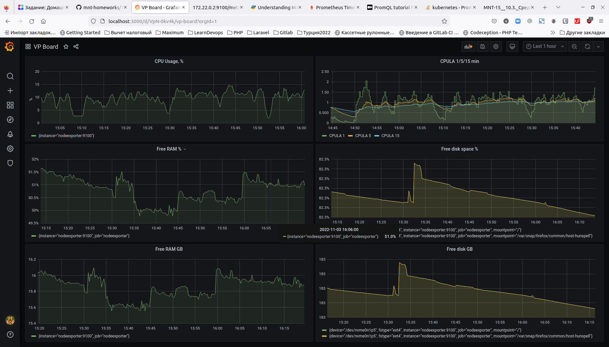
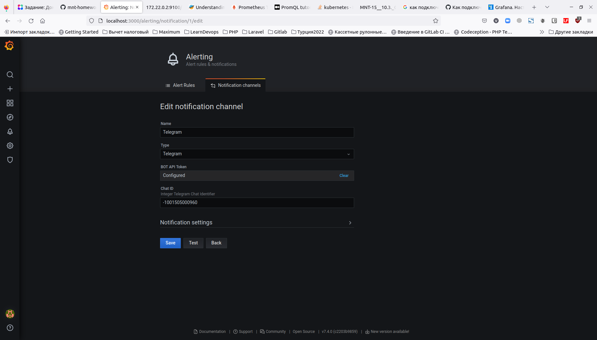
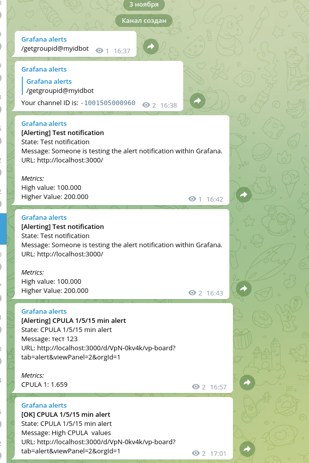
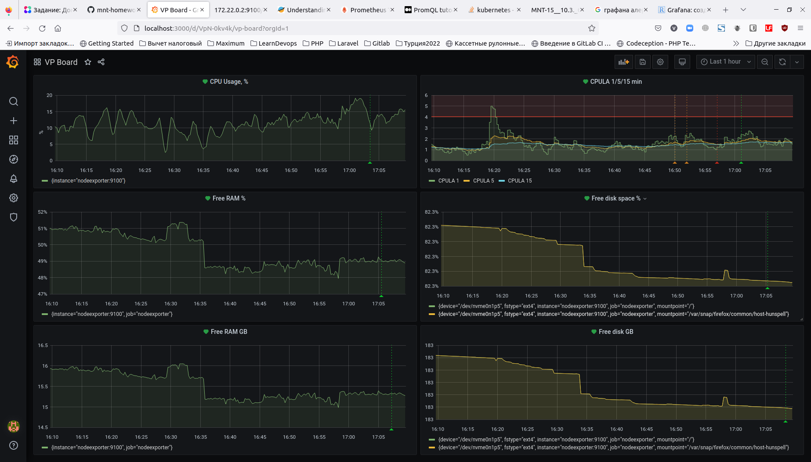

# Домашнее задание к занятию "10.03. Grafana"


## Обязательные задания

### Задание 1
Используя директорию [help](./help) внутри данного домашнего задания - запустите связку prometheus-grafana.

Зайдите в веб-интерфейс графана, используя авторизационные данные, указанные в манифесте docker-compose.

Подключите поднятый вами prometheus как источник данных.

Решение домашнего задания - скриншот веб-интерфейса grafana со списком подключенных Datasource.

**Решение:**




## Задание 2
Изучите самостоятельно ресурсы:
- [PromQL query to find CPU and memory](https://stackoverflow.com/questions/62770744/promql-query-to-find-cpu-and-memory-used-for-the-last-week)
- [PromQL tutorial](https://valyala.medium.com/promql-tutorial-for-beginners-9ab455142085)
- [Understanding Prometheus CPU metrics](https://www.robustperception.io/understanding-machine-cpu-usage)

Создайте Dashboard и в ней создайте следующие Panels:
- Утилизация CPU для nodeexporter (в процентах, 100-idle)
- CPULA 1/5/15
- Количество свободной оперативной памяти
- Количество места на файловой системе

Для решения данного ДЗ приведите promql запросы для выдачи этих метрик, а также скриншот получившейся Dashboard.

**Решение:**

- Утилизация CPU для nodeexporter (в процентах, 100-idle)

`100 - (avg by (instance) (rate(node_cpu_seconds_total{mode="idle",job="nodeexporter"}[1m])) * 100)`

- CPULA 1/5/15

  - `node_load1{job="nodeexporter"}`

  - `node_load5{job="nodeexporter"}`

  - `node_load15{job="nodeexporter"}`

- Количество свободной оперативной памяти

     - `(node_memory_MemFree_bytes{job="nodeexporter"} / node_memory_MemTotal_bytes{job="nodeexporter"}) * 100
`
     - `node_memory_MemFree_bytes{job="nodeexporter"} / 1024 / 1024 / 1024`

- Количество места на файловой системе

  - `(node_filesystem_free_bytes{job="nodeexporter",fstype!~"vfat|tmpfs|ramfs"} / node_filesystem_size_bytes{job="nodeexporter",fstype!~"vfat|tmpfs|ramfs"}) * 100`

  - `node_filesystem_free_bytes{job="nodeexporter",fstype!~"ramfs|tmpfs|vfat"} / 1024 / 1024 / 1024`



## Задание 3
Создайте для каждой Dashboard подходящее правило alert (можно обратиться к первой лекции в блоке "Мониторинг").

Для решения ДЗ - приведите скриншот вашей итоговой Dashboard.

**Решение:**

Настроил подключение Telegram в качестве канала для алертов:



При тестировании алертов пробные алерты пришли в Телеграм:



Затем скорректировал правила, настроил актуальные алерты.
Итоговый дашборд:



## Задание 4
Сохраните ваш Dashboard.

Для этого перейдите в настройки Dashboard, выберите в боковом меню "JSON MODEL".

Далее скопируйте отображаемое json-содержимое в отдельный файл и сохраните его.

В решении задания - приведите листинг этого файла.

**Решение:**

```json
{
  "annotations": {
    "list": [
      {
        "builtIn": 1,
        "datasource": "-- Grafana --",
        "enable": true,
        "hide": true,
        "iconColor": "rgba(0, 211, 255, 1)",
        "name": "Annotations & Alerts",
        "type": "dashboard"
      }
    ]
  },
  "editable": true,
  "gnetId": null,
  "graphTooltip": 0,
  "id": 1,
  "links": [],
  "panels": [
    {
      "alert": {
        "alertRuleTags": {},
        "conditions": [
          {
            "evaluator": {
              "params": [
                30
              ],
              "type": "gt"
            },
            "operator": {
              "type": "and"
            },
            "query": {
              "params": [
                "A",
                "5m",
                "now"
              ]
            },
            "reducer": {
              "params": [],
              "type": "avg"
            },
            "type": "query"
          }
        ],
        "executionErrorState": "alerting",
        "for": "3m",
        "frequency": "1m",
        "handler": 1,
        "message": "High CPU load",
        "name": "CPU Usage, % alert",
        "noDataState": "no_data",
        "notifications": [
          {
            "uid": "ZUxEakv4k"
          }
        ]
      },
      "aliasColors": {},
      "bars": false,
      "dashLength": 10,
      "dashes": false,
      "datasource": null,
      "fieldConfig": {
        "defaults": {
          "color": {},
          "custom": {},
          "thresholds": {
            "mode": "absolute",
            "steps": []
          },
          "unit": "short"
        },
        "overrides": []
      },
      "fill": 1,
      "fillGradient": 0,
      "gridPos": {
        "h": 7,
        "w": 12,
        "x": 0,
        "y": 0
      },
      "hiddenSeries": false,
      "id": 4,
      "legend": {
        "avg": false,
        "current": false,
        "max": false,
        "min": false,
        "show": true,
        "total": false,
        "values": false
      },
      "lines": true,
      "linewidth": 1,
      "nullPointMode": "null",
      "options": {
        "alertThreshold": true
      },
      "percentage": false,
      "pluginVersion": "7.4.0",
      "pointradius": 2,
      "points": false,
      "renderer": "flot",
      "seriesOverrides": [],
      "spaceLength": 10,
      "stack": false,
      "steppedLine": false,
      "targets": [
        {
          "expr": "100 - (avg by (instance) (rate(node_cpu_seconds_total{mode=\"idle\",job=\"nodeexporter\"}[1m])) * 100)",
          "interval": "",
          "intervalFactor": 1,
          "legendFormat": "",
          "refId": "A"
        }
      ],
      "thresholds": [
        {
          "colorMode": "critical",
          "fill": true,
          "line": true,
          "op": "gt",
          "value": 30,
          "visible": true
        }
      ],
      "timeFrom": null,
      "timeRegions": [],
      "timeShift": null,
      "title": "CPU Usage, %",
      "tooltip": {
        "shared": true,
        "sort": 0,
        "value_type": "individual"
      },
      "type": "graph",
      "xaxis": {
        "buckets": null,
        "mode": "time",
        "name": null,
        "show": true,
        "values": []
      },
      "yaxes": [
        {
          "$$hashKey": "object:504",
          "format": "short",
          "label": "%",
          "logBase": 1,
          "max": null,
          "min": null,
          "show": true
        },
        {
          "$$hashKey": "object:505",
          "format": "short",
          "label": null,
          "logBase": 1,
          "max": null,
          "min": null,
          "show": true
        }
      ],
      "yaxis": {
        "align": false,
        "alignLevel": null
      }
    },
    {
      "alert": {
        "alertRuleTags": {},
        "conditions": [
          {
            "evaluator": {
              "params": [
                4
              ],
              "type": "gt"
            },
            "operator": {
              "type": "and"
            },
            "query": {
              "params": [
                "A",
                "5m",
                "now"
              ]
            },
            "reducer": {
              "params": [],
              "type": "avg"
            },
            "type": "query"
          }
        ],
        "executionErrorState": "alerting",
        "for": "5m",
        "frequency": "1m",
        "handler": 1,
        "message": "High CPULA  values",
        "name": "CPULA 1/5/15 min alert",
        "noDataState": "no_data",
        "notifications": [
          {
            "uid": "ZUxEakv4k"
          }
        ]
      },
      "aliasColors": {},
      "bars": false,
      "dashLength": 10,
      "dashes": false,
      "datasource": null,
      "description": "",
      "fieldConfig": {
        "defaults": {
          "color": {},
          "custom": {},
          "thresholds": {
            "mode": "absolute",
            "steps": []
          }
        },
        "overrides": []
      },
      "fill": 1,
      "fillGradient": 0,
      "gridPos": {
        "h": 7,
        "w": 12,
        "x": 12,
        "y": 0
      },
      "hiddenSeries": false,
      "id": 2,
      "legend": {
        "avg": false,
        "current": false,
        "max": false,
        "min": false,
        "show": true,
        "total": false,
        "values": false
      },
      "lines": true,
      "linewidth": 1,
      "nullPointMode": "null",
      "options": {
        "alertThreshold": true
      },
      "percentage": false,
      "pluginVersion": "7.4.0",
      "pointradius": 2,
      "points": false,
      "renderer": "flot",
      "seriesOverrides": [],
      "spaceLength": 10,
      "stack": false,
      "steppedLine": true,
      "targets": [
        {
          "exemplar": false,
          "expr": "node_load1{job=\"nodeexporter\"}",
          "hide": false,
          "interval": "",
          "intervalFactor": 1,
          "legendFormat": "CPULA 1",
          "refId": "A"
        },
        {
          "expr": "node_load5{job=\"nodeexporter\"}",
          "hide": false,
          "interval": "",
          "legendFormat": "CPULA 5",
          "refId": "B"
        },
        {
          "expr": "node_load15{job=\"nodeexporter\"}",
          "hide": false,
          "interval": "",
          "legendFormat": "CPULA 15",
          "refId": "C"
        }
      ],
      "thresholds": [
        {
          "colorMode": "critical",
          "fill": true,
          "line": true,
          "op": "gt",
          "value": 4,
          "visible": true
        }
      ],
      "timeFrom": null,
      "timeRegions": [],
      "timeShift": null,
      "title": "CPULA 1/5/15 min",
      "tooltip": {
        "shared": true,
        "sort": 0,
        "value_type": "individual"
      },
      "type": "graph",
      "xaxis": {
        "buckets": null,
        "mode": "time",
        "name": null,
        "show": true,
        "values": []
      },
      "yaxes": [
        {
          "$$hashKey": "object:1184",
          "format": "short",
          "label": null,
          "logBase": 1,
          "max": null,
          "min": null,
          "show": true
        },
        {
          "$$hashKey": "object:1185",
          "format": "short",
          "label": null,
          "logBase": 1,
          "max": null,
          "min": null,
          "show": true
        }
      ],
      "yaxis": {
        "align": false,
        "alignLevel": null
      }
    },
    {
      "alert": {
        "alertRuleTags": {},
        "conditions": [
          {
            "evaluator": {
              "params": [
                10
              ],
              "type": "lt"
            },
            "operator": {
              "type": "and"
            },
            "query": {
              "params": [
                "A",
                "1m",
                "now"
              ]
            },
            "reducer": {
              "params": [],
              "type": "avg"
            },
            "type": "query"
          }
        ],
        "executionErrorState": "alerting",
        "for": "3m",
        "frequency": "1m",
        "handler": 1,
        "message": "Low RAM available",
        "name": "Free RAM % alert",
        "noDataState": "no_data",
        "notifications": [
          {
            "uid": "ZUxEakv4k"
          }
        ]
      },
      "aliasColors": {},
      "bars": false,
      "dashLength": 10,
      "dashes": false,
      "datasource": null,
      "fieldConfig": {
        "defaults": {
          "custom": {}
        },
        "overrides": []
      },
      "fill": 1,
      "fillGradient": 0,
      "gridPos": {
        "h": 8,
        "w": 12,
        "x": 0,
        "y": 7
      },
      "hiddenSeries": false,
      "id": 6,
      "legend": {
        "avg": false,
        "current": false,
        "max": false,
        "min": false,
        "show": true,
        "total": false,
        "values": false
      },
      "lines": true,
      "linewidth": 1,
      "nullPointMode": "null",
      "options": {
        "alertThreshold": true
      },
      "percentage": false,
      "pluginVersion": "7.4.0",
      "pointradius": 2,
      "points": false,
      "renderer": "flot",
      "seriesOverrides": [],
      "spaceLength": 10,
      "stack": false,
      "steppedLine": false,
      "targets": [
        {
          "expr": "(node_memory_MemFree_bytes{job=\"nodeexporter\"} / node_memory_MemTotal_bytes{job=\"nodeexporter\"}) * 100",
          "interval": "",
          "legendFormat": "",
          "refId": "A"
        }
      ],
      "thresholds": [
        {
          "colorMode": "critical",
          "fill": true,
          "line": true,
          "op": "lt",
          "value": 10,
          "visible": true
        }
      ],
      "timeFrom": null,
      "timeRegions": [],
      "timeShift": null,
      "title": "Free RAM %",
      "tooltip": {
        "shared": true,
        "sort": 0,
        "value_type": "individual"
      },
      "type": "graph",
      "xaxis": {
        "buckets": null,
        "mode": "time",
        "name": null,
        "show": true,
        "values": []
      },
      "yaxes": [
        {
          "$$hashKey": "object:454",
          "format": "percent",
          "label": "",
          "logBase": 1,
          "max": null,
          "min": null,
          "show": true
        },
        {
          "$$hashKey": "object:455",
          "format": "short",
          "label": null,
          "logBase": 1,
          "max": null,
          "min": null,
          "show": true
        }
      ],
      "yaxis": {
        "align": false,
        "alignLevel": null
      }
    },
    {
      "alert": {
        "alertRuleTags": {},
        "conditions": [
          {
            "evaluator": {
              "params": [
                10
              ],
              "type": "lt"
            },
            "operator": {
              "type": "and"
            },
            "query": {
              "params": [
                "A",
                "5m",
                "now"
              ]
            },
            "reducer": {
              "params": [],
              "type": "avg"
            },
            "type": "query"
          }
        ],
        "executionErrorState": "alerting",
        "for": "5m",
        "frequency": "1m",
        "handler": 1,
        "message": "Low disk space available",
        "name": "Free disk space % alert",
        "noDataState": "no_data",
        "notifications": [
          {
            "uid": "ZUxEakv4k"
          }
        ]
      },
      "aliasColors": {},
      "bars": false,
      "dashLength": 10,
      "dashes": false,
      "datasource": null,
      "fieldConfig": {
        "defaults": {
          "custom": {}
        },
        "overrides": []
      },
      "fill": 1,
      "fillGradient": 0,
      "gridPos": {
        "h": 8,
        "w": 12,
        "x": 12,
        "y": 7
      },
      "hiddenSeries": false,
      "id": 8,
      "legend": {
        "avg": false,
        "current": false,
        "max": false,
        "min": false,
        "show": true,
        "total": false,
        "values": false
      },
      "lines": true,
      "linewidth": 1,
      "nullPointMode": "null",
      "options": {
        "alertThreshold": true
      },
      "percentage": false,
      "pluginVersion": "7.4.0",
      "pointradius": 2,
      "points": false,
      "renderer": "flot",
      "seriesOverrides": [],
      "spaceLength": 10,
      "stack": false,
      "steppedLine": false,
      "targets": [
        {
          "expr": "(node_filesystem_free_bytes{job=\"nodeexporter\",fstype!~\"vfat|tmpfs|ramfs\"} / node_filesystem_size_bytes{job=\"nodeexporter\",fstype!~\"vfat|tmpfs|ramfs\"}) * 100",
          "interval": "",
          "legendFormat": "",
          "refId": "A"
        }
      ],
      "thresholds": [
        {
          "colorMode": "critical",
          "fill": true,
          "line": true,
          "op": "lt",
          "value": 10,
          "visible": true
        }
      ],
      "timeFrom": null,
      "timeRegions": [],
      "timeShift": null,
      "title": "Free disk space %",
      "tooltip": {
        "shared": true,
        "sort": 0,
        "value_type": "individual"
      },
      "type": "graph",
      "xaxis": {
        "buckets": null,
        "mode": "time",
        "name": null,
        "show": true,
        "values": []
      },
      "yaxes": [
        {
          "$$hashKey": "object:810",
          "format": "percent",
          "label": null,
          "logBase": 1,
          "max": null,
          "min": null,
          "show": true
        },
        {
          "$$hashKey": "object:811",
          "format": "short",
          "label": null,
          "logBase": 1,
          "max": null,
          "min": null,
          "show": true
        }
      ],
      "yaxis": {
        "align": false,
        "alignLevel": null
      }
    },
    {
      "alert": {
        "alertRuleTags": {},
        "conditions": [
          {
            "evaluator": {
              "params": [
                0.5
              ],
              "type": "lt"
            },
            "operator": {
              "type": "and"
            },
            "query": {
              "params": [
                "A",
                "5m",
                "now"
              ]
            },
            "reducer": {
              "params": [],
              "type": "avg"
            },
            "type": "query"
          }
        ],
        "executionErrorState": "alerting",
        "for": "5m",
        "frequency": "1m",
        "handler": 1,
        "message": "Low free memory",
        "name": "Free RAM GB alert",
        "noDataState": "no_data",
        "notifications": [
          {
            "uid": "ZUxEakv4k"
          }
        ]
      },
      "aliasColors": {},
      "bars": false,
      "dashLength": 10,
      "dashes": false,
      "datasource": null,
      "fieldConfig": {
        "defaults": {
          "custom": {}
        },
        "overrides": []
      },
      "fill": 1,
      "fillGradient": 0,
      "gridPos": {
        "h": 8,
        "w": 12,
        "x": 0,
        "y": 15
      },
      "hiddenSeries": false,
      "id": 12,
      "legend": {
        "avg": false,
        "current": false,
        "max": false,
        "min": false,
        "show": true,
        "total": false,
        "values": false
      },
      "lines": true,
      "linewidth": 1,
      "nullPointMode": "null",
      "options": {
        "alertThreshold": true
      },
      "percentage": false,
      "pluginVersion": "7.4.0",
      "pointradius": 2,
      "points": false,
      "renderer": "flot",
      "seriesOverrides": [],
      "spaceLength": 10,
      "stack": false,
      "steppedLine": false,
      "targets": [
        {
          "expr": "node_memory_MemFree_bytes{job=\"nodeexporter\"} / 1024 / 1024 / 1024",
          "interval": "",
          "legendFormat": "",
          "refId": "A"
        }
      ],
      "thresholds": [
        {
          "colorMode": "critical",
          "fill": true,
          "line": true,
          "op": "lt",
          "value": 0.5,
          "visible": true
        }
      ],
      "timeFrom": null,
      "timeRegions": [],
      "timeShift": null,
      "title": "Free RAM GB",
      "tooltip": {
        "shared": true,
        "sort": 0,
        "value_type": "individual"
      },
      "type": "graph",
      "xaxis": {
        "buckets": null,
        "mode": "time",
        "name": null,
        "show": true,
        "values": []
      },
      "yaxes": [
        {
          "$$hashKey": "object:1080",
          "format": "short",
          "label": null,
          "logBase": 1,
          "max": null,
          "min": null,
          "show": true
        },
        {
          "$$hashKey": "object:1081",
          "format": "short",
          "label": null,
          "logBase": 1,
          "max": null,
          "min": null,
          "show": true
        }
      ],
      "yaxis": {
        "align": false,
        "alignLevel": null
      }
    },
    {
      "alert": {
        "alertRuleTags": {},
        "conditions": [
          {
            "evaluator": {
              "params": [
                10
              ],
              "type": "lt"
            },
            "operator": {
              "type": "and"
            },
            "query": {
              "params": [
                "A",
                "5m",
                "now"
              ]
            },
            "reducer": {
              "params": [],
              "type": "avg"
            },
            "type": "query"
          }
        ],
        "executionErrorState": "alerting",
        "for": "5m",
        "frequency": "1m",
        "handler": 1,
        "message": "Low disk space available",
        "name": "Free disk GB alert",
        "noDataState": "no_data",
        "notifications": [
          {
            "uid": "ZUxEakv4k"
          }
        ]
      },
      "aliasColors": {},
      "bars": false,
      "dashLength": 10,
      "dashes": false,
      "datasource": null,
      "fieldConfig": {
        "defaults": {
          "custom": {}
        },
        "overrides": []
      },
      "fill": 1,
      "fillGradient": 0,
      "gridPos": {
        "h": 8,
        "w": 12,
        "x": 12,
        "y": 15
      },
      "hiddenSeries": false,
      "id": 10,
      "legend": {
        "avg": false,
        "current": false,
        "max": false,
        "min": false,
        "show": true,
        "total": false,
        "values": false
      },
      "lines": true,
      "linewidth": 1,
      "nullPointMode": "null",
      "options": {
        "alertThreshold": true
      },
      "percentage": false,
      "pluginVersion": "7.4.0",
      "pointradius": 2,
      "points": false,
      "renderer": "flot",
      "seriesOverrides": [],
      "spaceLength": 10,
      "stack": false,
      "steppedLine": false,
      "targets": [
        {
          "expr": "node_filesystem_free_bytes{job=\"nodeexporter\",fstype!~\"ramfs|tmpfs|vfat\"} / 1024 / 1024 / 1024",
          "interval": "",
          "legendFormat": "",
          "refId": "A"
        }
      ],
      "thresholds": [
        {
          "colorMode": "critical",
          "fill": true,
          "line": true,
          "op": "lt",
          "value": 10,
          "visible": true
        }
      ],
      "timeFrom": null,
      "timeRegions": [],
      "timeShift": null,
      "title": "Free disk GB",
      "tooltip": {
        "shared": true,
        "sort": 0,
        "value_type": "individual"
      },
      "type": "graph",
      "xaxis": {
        "buckets": null,
        "mode": "time",
        "name": null,
        "show": true,
        "values": []
      },
      "yaxes": [
        {
          "$$hashKey": "object:1020",
          "format": "short",
          "label": null,
          "logBase": 1,
          "max": null,
          "min": null,
          "show": true
        },
        {
          "$$hashKey": "object:1021",
          "format": "short",
          "label": null,
          "logBase": 1,
          "max": null,
          "min": null,
          "show": true
        }
      ],
      "yaxis": {
        "align": false,
        "alignLevel": null
      }
    }
  ],
  "schemaVersion": 27,
  "style": "dark",
  "tags": [],
  "templating": {
    "list": []
  },
  "time": {
    "from": "now-1h",
    "to": "now"
  },
  "timepicker": {},
  "timezone": "",
  "title": "VP Board",
  "uid": "VpN-0kv4k",
  "version": 21
}
```
